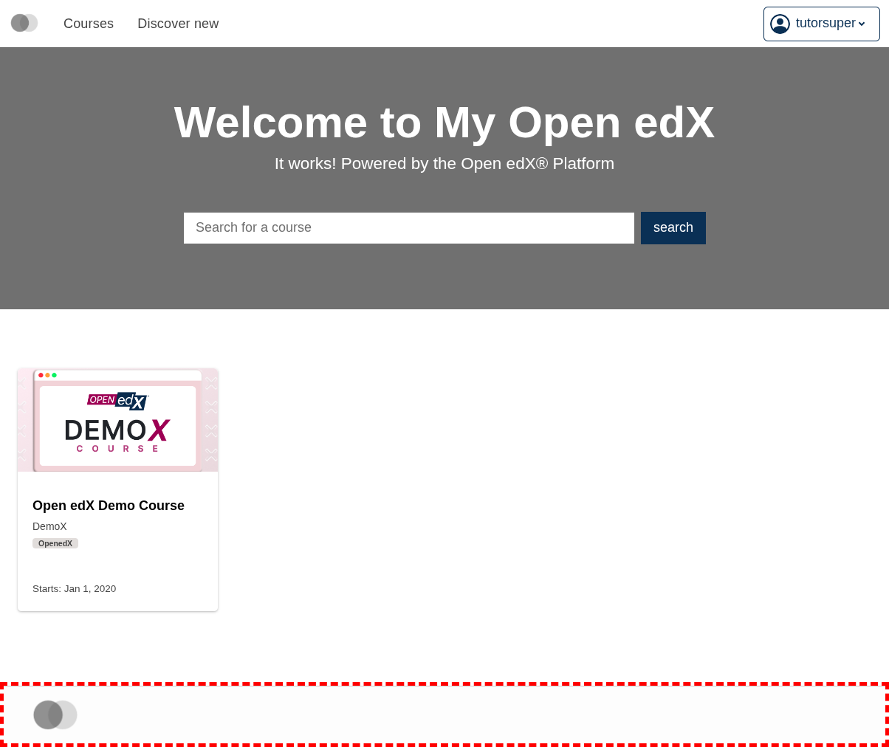

# Footer Slot

### Slot ID: `org.openedx.frontend.layout.footer.v1`

### Slot ID Aliases
* `footer_slot`

## Description

This slot is used to replace/modify/hide the footer.

The implementation of the `FooterSlot` component lives in [the `frontend-component-footer` repository](https://github.com/openedx/frontend-component-footer/).



## Example

The following `env.config.jsx` will replace the default footer with a simple custom footer.


```jsx
import { DIRECT_PLUGIN, PLUGIN_OPERATIONS } from '@openedx/frontend-plugin-framework';

const config = {
  pluginSlots: {
    'org.openedx.frontend.layout.footer.v1': {
      plugins: [
        {
          // Insert a custom footer
          op: PLUGIN_OPERATIONS.Insert,
          widget: {
            id: 'custom_footer',
            type: DIRECT_PLUGIN,
            RenderWidget: () => (
              <h1 style={{textAlign: 'center'}}>🦶</h1>
            ),
          },
        },
      ]
    }
  },
}

export default config;
```
