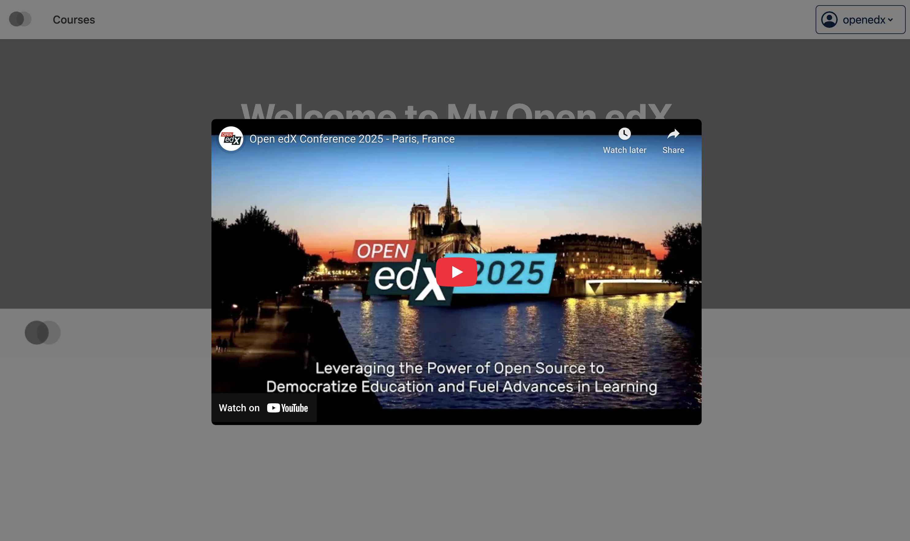
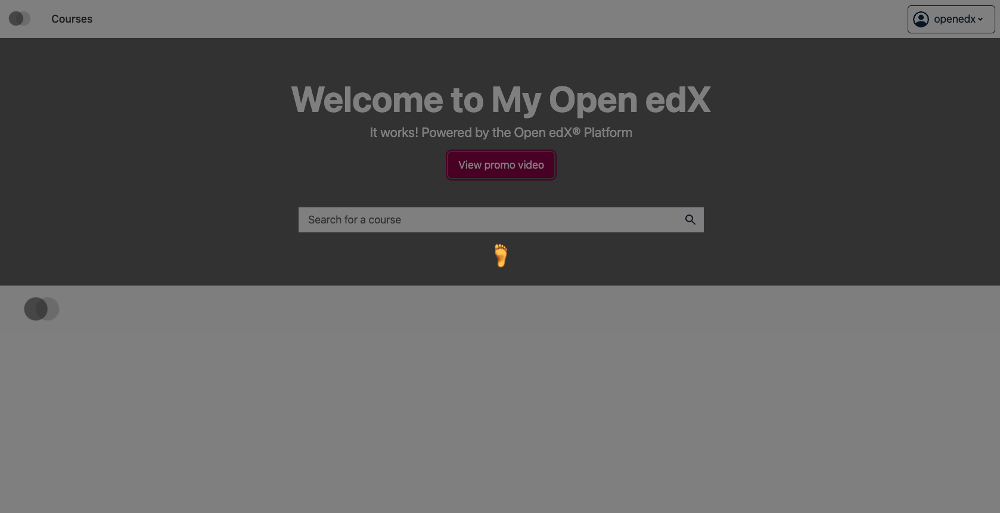

# Generic Video Modal content slot

### Description

This slot provides a custom content area nested inside the [VideoModal](../../generic/video-modal/index.tsx) component.

### Slot IDs:

- `org.openedx.frontend.catalog.home_page.promo_video_modal_content` - This slot is used to replace/modify/hide the entire video modal content on the Home page.

## Examples

### `org.openedx.frontend.catalog.home_page.promo_video_modal_content`

### Default content



### Replaced with custom component



The following `env.config.tsx` will replace the Home page promo video modal content entirely (in this case with a centered `h1` tag)

```tsx
import { DIRECT_PLUGIN, PLUGIN_OPERATIONS } from '@openedx/frontend-plugin-framework';

const config = {
  pluginSlots: {
    'org.openedx.frontend.catalog.home_page.promo_video_modal_content': {
      keepDefault: false,
      plugins: [
        {
          op: PLUGIN_OPERATIONS.Insert,
          widget: {
            id: 'custom_home_page_promo_video_modal_content_component',
            type: DIRECT_PLUGIN,
            RenderWidget: () => (
              <h1 style={{textAlign: 'center'}}>🦶</h1>
            ),
          },
        },
      ]
    }
  },
}

export default config;
```
