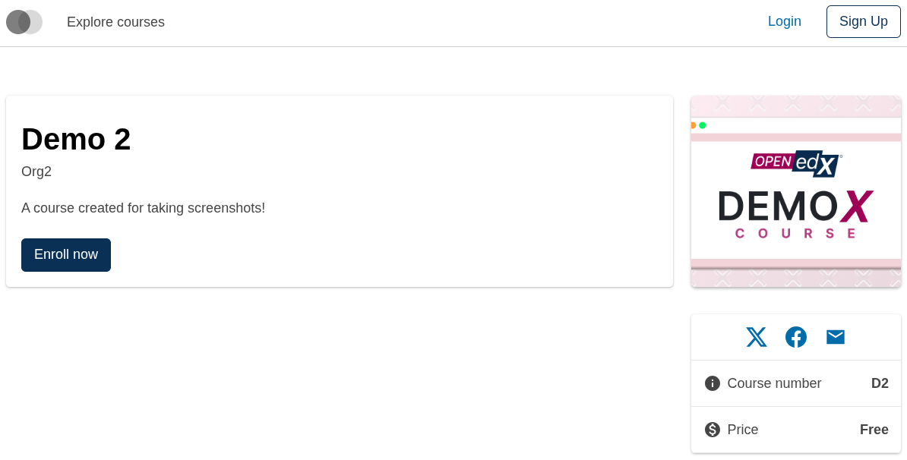
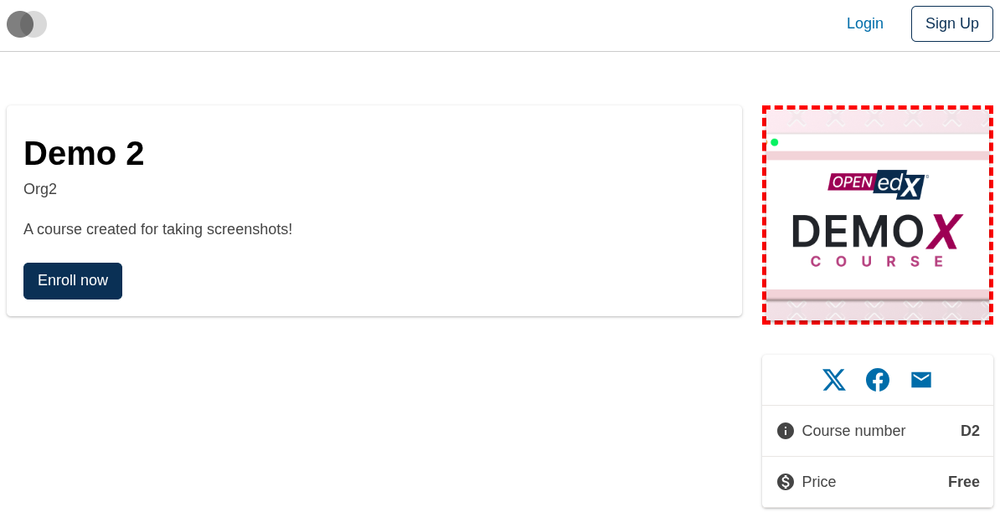
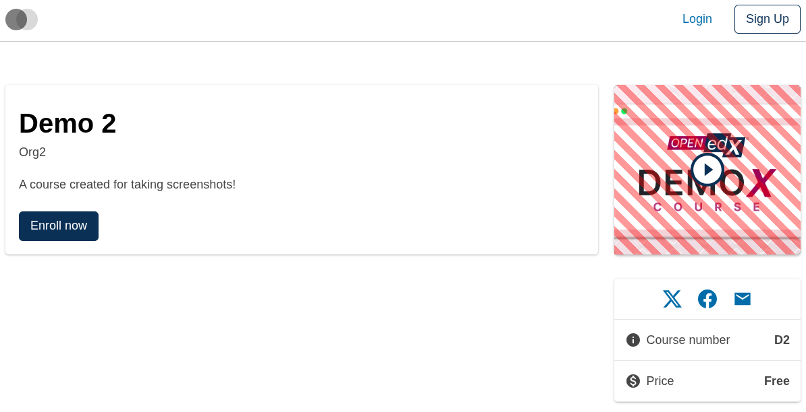
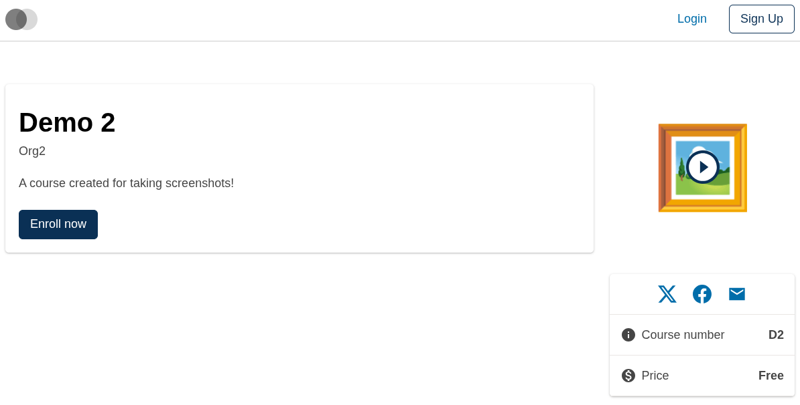
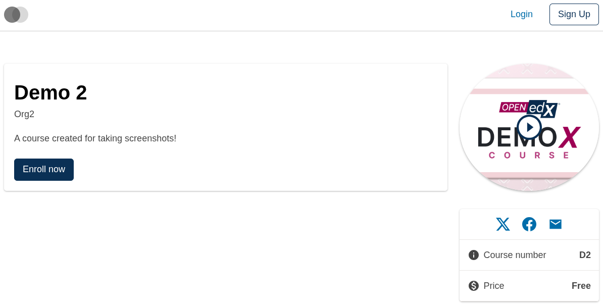

# Course About Course Image Slot

### Slot ID: `org.openedx.frontend.slot.catalog.courseAboutCourseImage.v1`

### Slot Props

* `imgSrc: string` — the src URL for the course image.
* `altText: string` — alt text for the course image.

## Description

This slot is used to replace/modify/hide the entire Course about page course image.

Where this slot is rendered depends on whether the course has a promo video:

- **Course without a promo video** — `CourseMedia` renders this slot directly and it stands alone.
- **Course with a promo video** — `CourseMedia` renders `CourseAboutIntroVideoButtonSlot` instead, which wraps this slot in a `<Button className="position-relative">` alongside an absolutely-positioned play-icon sibling. The button's click handler opens the promo-video modal.

That composition means customizations to this slot (including layout wraps or overlays) render **inside** the button, as normal-flow siblings of the play icon. Because the icon is `position: absolute` and appears after the image in DOM order, it paints on top — so the play button stays visible above whatever this slot renders.

## Examples

### Default content



### Wrapped with a red border (custom layout)



To keep the default content but wrap it in extra markup, replace the slot's **layout**. Screenshot is from a course without a promo video, so `CourseMedia` renders this slot standalone (no `<Button>` wrapper, no play icon sibling).

```diff
-import { EnvironmentTypes, SiteConfig, ... } from '@openedx/frontend-base';
+import { EnvironmentTypes, LayoutOperationTypes, SiteConfig, useWidgets, ... } from '@openedx/frontend-base';

 import { catalogApp } from './src';

 import '@openedx/frontend-base/shell/style';

+const BorderedLayout = () => {
+  const widgets = useWidgets();
+  return <div style={{ border: 'thick dashed red' }}>{widgets}</div>;
+};
+
 const siteConfig: SiteConfig = {
   // ...
   apps: [
     // ...
     {
       ...catalogApp,
+      slots: [
+        {
+          slotId: 'org.openedx.frontend.slot.catalog.courseAboutCourseImage.v1',
+          op: LayoutOperationTypes.REPLACE,
+          component: BorderedLayout,
+        },
+      ],
     },
   ],
 };
```

### Overlaid with diagonal stripes (custom layout, video course)



For a course with a promo video, this layout adds a semi-transparent diagonal-stripe overlay on top of the image. Because this slot lives inside `CourseAboutIntroVideoButtonSlot`'s `<Button>` and the play icon is an absolutely-positioned sibling that paints later in DOM order, the icon stays on top of anything this slot layers in.

```diff
-import { EnvironmentTypes, SiteConfig, ... } from '@openedx/frontend-base';
+import { EnvironmentTypes, LayoutOperationTypes, SiteConfig, useWidgets, ... } from '@openedx/frontend-base';

 import { catalogApp } from './src';

 import '@openedx/frontend-base/shell/style';

+const StripedLayout = () => {
+  const widgets = useWidgets();
+  return (
+    <div style={{ position: 'relative' }}>
+      {widgets}
+      <div
+        aria-hidden
+        style={{
+          position: 'absolute',
+          inset: 0,
+          background: 'repeating-linear-gradient(45deg, rgba(255,0,0,0.4) 0 10px, transparent 10px 20px)',
+          pointerEvents: 'none',
+        }}
+      />
+    </div>
+  );
+};
+
 const siteConfig: SiteConfig = {
   // ...
   apps: [
     // ...
     {
       ...catalogApp,
+      slots: [
+        {
+          slotId: 'org.openedx.frontend.slot.catalog.courseAboutCourseImage.v1',
+          op: LayoutOperationTypes.REPLACE,
+          component: StripedLayout,
+        },
+      ],
     },
   ],
 };
```

### Replaced with a simple custom component



Add the following to your site config to replace the course image entirely (in this case with a large "🖼️" `div`).

```diff
-import { EnvironmentTypes, SiteConfig, ... } from '@openedx/frontend-base';
+import { EnvironmentTypes, WidgetOperationTypes, SiteConfig, ... } from '@openedx/frontend-base';

 const siteConfig: SiteConfig = {
   // ...
   apps: [
     // ...
     {
       ...catalogApp,
+      slots: [
+        {
+          slotId: 'org.openedx.frontend.slot.catalog.courseAboutCourseImage.v1',
+          id: 'customCourseAboutCourseImage',
+          op: WidgetOperationTypes.REPLACE,
+          relatedId: 'defaultContent',
+          element: <div className="m-5.5 display-4">🖼️</div>,
+        },
+      ],
     },
   ],
 };
```

### Replaced with a custom component using the slot's props



Add the following to your site config to replace the course image with a custom component that reads the slot's `imgSrc` and `altText` props.

```diff
-import { EnvironmentTypes, SiteConfig, ... } from '@openedx/frontend-base';
+import { EnvironmentTypes, WidgetOperationTypes, SiteConfig, ... } from '@openedx/frontend-base';

-import { catalogApp } from './src';
+import { catalogApp, type CourseAboutCourseImageSlotProps } from './src';

 import '@openedx/frontend-base/shell/style';

+import { Image } from '@openedx/paragon';
+
+const customCourseImage = ({ imgSrc, altText }: CourseAboutCourseImageSlotProps) => (
+  <Image
+    className="course-media-image shadow w-100"
+    src={imgSrc}
+    roundedCircle
+    alt={altText}
+  />
+);
+
 const siteConfig: SiteConfig = {
   // ...
   apps: [
     // ...
     {
       ...catalogApp,
+      slots: [
+        {
+          slotId: 'org.openedx.frontend.slot.catalog.courseAboutCourseImage.v1',
+          id: 'customCourseAboutCourseImage',
+          op: WidgetOperationTypes.REPLACE,
+          relatedId: 'defaultContent',
+          component: customCourseImage,
+        },
+      ],
     },
   ],
 };
```
