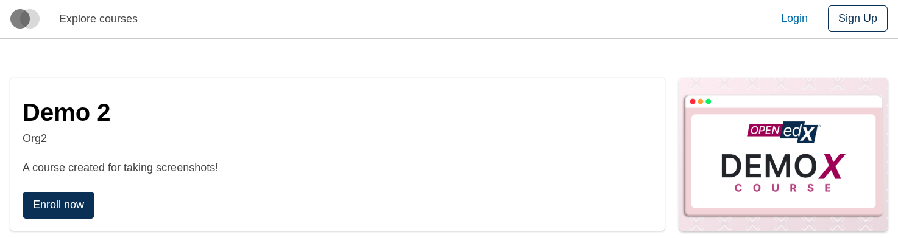
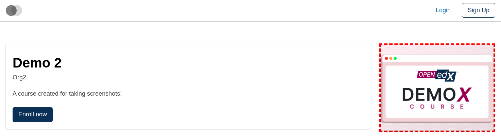
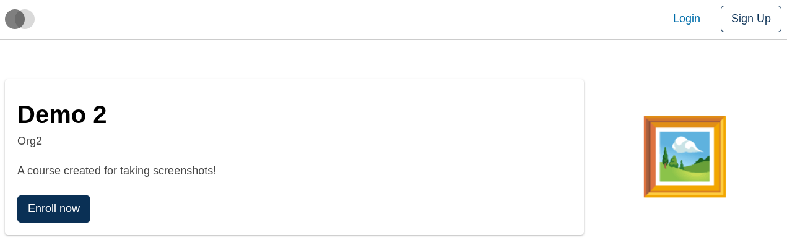
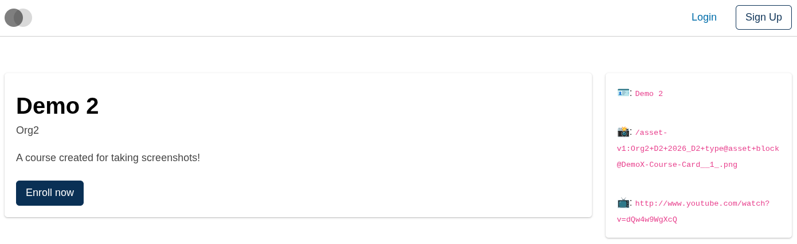

# Course About Course Media Slot

### Slot ID: `org.openedx.frontend.slot.catalog.courseAboutCourseMedia.v1`

### Slot Props

* `courseAboutData.name: string` — the course's display name.
* `courseAboutData.media.courseImage.uri: string | null` — path to the course image.
* `courseAboutData.media.courseVideo?.uri: string | null` — optional path to the course promo video.

## Description

This slot is used to replace/modify/hide the entire Course about page course media section.

## Examples

### Default content



### Wrapped with a red border (custom layout)



To keep the default content but wrap it in extra markup, replace the slot's **layout** (not its widget). The layout receives the widget list — which includes the synthetic `defaultContent` — and can render it inside anything.

```diff
-import { EnvironmentTypes, SiteConfig, ... } from '@openedx/frontend-base';
+import { EnvironmentTypes, LayoutOperationTypes, SiteConfig, useWidgets, ... } from '@openedx/frontend-base';

 import { catalogApp } from './src';

 import '@openedx/frontend-base/shell/style';

+const BorderedLayout = () => {
+  const widgets = useWidgets();
+  return <div style={{ border: 'thick dashed red' }}>{widgets}</div>;
+};
+
 const siteConfig: SiteConfig = {
   // ...
   apps: [
     // ...
     {
       ...catalogApp,
+      slots: [
+        {
+          slotId: 'org.openedx.frontend.slot.catalog.courseAboutCourseMedia.v1',
+          op: LayoutOperationTypes.REPLACE,
+          component: BorderedLayout,
+        },
+      ],
     },
   ],
 };
```

### Replaced with a simple custom component



Add the following to your site config to replace the Course about page course media entirely (in this case with a large "🖼️" `div`). The diff below is against this app's `site.config.dev.tsx`.

```diff
-import { EnvironmentTypes, SiteConfig, ... } from '@openedx/frontend-base';
+import { EnvironmentTypes, WidgetOperationTypes, SiteConfig, ... } from '@openedx/frontend-base';

 const siteConfig: SiteConfig = {
   // ...
   apps: [
     // ...
     {
       ...catalogApp,
+      slots: [
+        {
+          slotId: 'org.openedx.frontend.slot.catalog.courseAboutCourseMedia.v1',
+          id: 'customCourseAboutCourseMedia',
+          op: WidgetOperationTypes.REPLACE,
+          relatedId: 'defaultContent',
+          element: <div className="m-5.5 display-4">🖼️</div>,
+        },
+      ],
     },
   ],
 };
```

### Replaced with a custom component using the slot's `courseAboutData` prop



Add the following to your site config to replace the Course about page course media with a custom component that reads the slot's `courseAboutData` prop. The diff below is against this app's `site.config.dev.tsx`.

```diff
-import { EnvironmentTypes, SiteConfig, ... } from '@openedx/frontend-base';
+import { EnvironmentTypes, WidgetOperationTypes, SiteConfig, ... } from '@openedx/frontend-base';

-import { catalogApp } from './src';
+import { catalogApp, type CourseAboutCourseMediaSlotProps } from './src';

 import '@openedx/frontend-base/shell/style';

+import { Card } from '@openedx/paragon';
+
+const customCourseAboutCourseMedia = ({ courseAboutData }: CourseAboutCourseMediaSlotProps) => (
+  <Card>
+    <Card.Section>
+      🪪: <code className="x-small">{courseAboutData.name}</code>
+    </Card.Section>
+    <Card.Section>
+      📸: <code className="x-small">{courseAboutData.media.courseImage.uri}</code>
+    </Card.Section>
+    <Card.Section>
+      📺: <code className="x-small">{courseAboutData.media.courseVideo?.uri}</code>
+    </Card.Section>
+  </Card>
+);
+
 const siteConfig: SiteConfig = {
   // ...
   apps: [
     // ...
     {
       ...catalogApp,
+      slots: [
+        {
+          slotId: 'org.openedx.frontend.slot.catalog.courseAboutCourseMedia.v1',
+          id: 'customCourseAboutCourseMedia',
+          op: WidgetOperationTypes.REPLACE,
+          relatedId: 'defaultContent',
+          component: customCourseAboutCourseMedia,
+        },
+      ],
     },
   ],
 };
```
