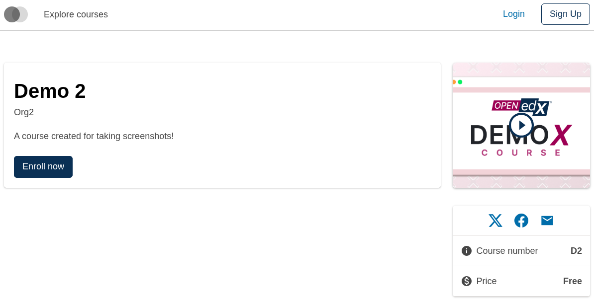
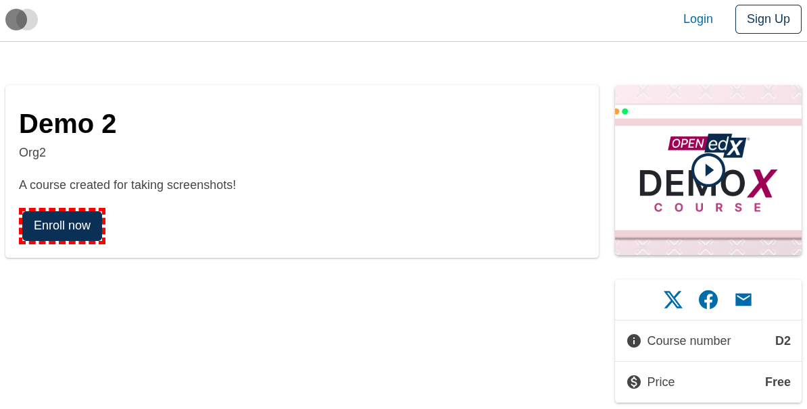
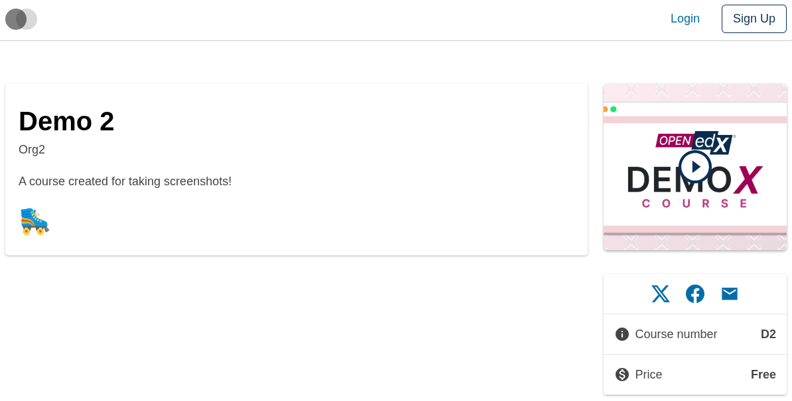
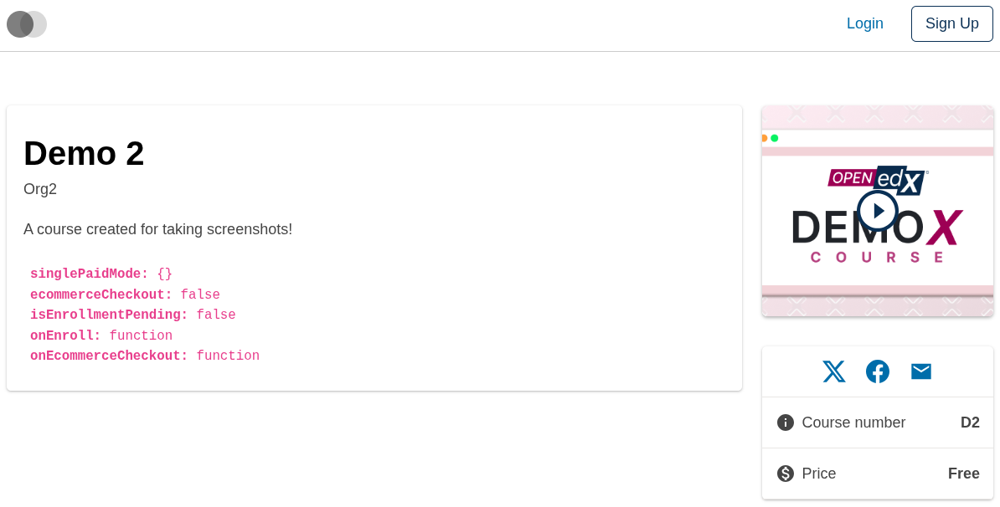

# Course About Enrollment Button Slot

### Slot ID: `org.openedx.frontend.slot.catalog.courseAboutEnrollmentButton.v1`

### Slot Props

* `singlePaidMode: SinglePaidMode` — record describing the course's single paid enrollment mode (empty object when the course has non-paid modes available). Used by the default `EnrollmentButton` to pick its variant (empty → `primary`, non-empty → `outline-primary`).
* `ecommerceCheckout: boolean` — selects which action fires when the button is clicked: `true` → `onEcommerceCheckout`, `false` → `onEnroll`.
* `isEnrollmentPending: boolean` — `true` while an enrollment request is in flight. Drives the default button's paragon `state="pending"` visual.
* `onEnroll: () => void` — invoke to trigger the enrollment flow.
* `onEcommerceCheckout: () => void` — invoke to trigger the ecommerce checkout flow.

## Description

This slot is used to replace/modify/hide the entire course enrollment button on the Course about page.

## Examples

### Default content



### Wrapped with a red border (custom layout)



To keep the default content but wrap it in extra markup, replace the slot's **layout**.

```diff
-import { EnvironmentTypes, SiteConfig, ... } from '@openedx/frontend-base';
+import { EnvironmentTypes, LayoutOperationTypes, SiteConfig, useWidgets, ... } from '@openedx/frontend-base';

 import { catalogApp } from './src';

 import '@openedx/frontend-base/shell/style';

+const BorderedLayout = () => {
+  const widgets = useWidgets();
+  return <div style={{ border: 'thick dashed red' }}>{widgets}</div>;
+};
+
 const siteConfig: SiteConfig = {
   // ...
   apps: [
     // ...
     {
       ...catalogApp,
+      slots: [
+        {
+          slotId: 'org.openedx.frontend.slot.catalog.courseAboutEnrollmentButton.v1',
+          op: LayoutOperationTypes.REPLACE,
+          component: BorderedLayout,
+        },
+      ],
     },
   ],
 };
```

### Replaced with a simple custom component



Add the following to your site config to replace the enrollment button entirely (in this case with a centered "🛼" `h1` tag).

```diff
-import { EnvironmentTypes, SiteConfig, ... } from '@openedx/frontend-base';
+import { EnvironmentTypes, WidgetOperationTypes, SiteConfig, ... } from '@openedx/frontend-base';

 const siteConfig: SiteConfig = {
   // ...
   apps: [
     // ...
     {
       ...catalogApp,
+      slots: [
+        {
+          slotId: 'org.openedx.frontend.slot.catalog.courseAboutEnrollmentButton.v1',
+          id: 'customCourseAboutEnrollmentButton',
+          op: WidgetOperationTypes.REPLACE,
+          relatedId: 'defaultContent',
+          element: <h1 style={{ textAlign: 'center' }}>🛼</h1>,
+        },
+      ],
     },
   ],
 };
```

### Replaced with a custom component displaying the slot's props



Add the following to your site config to replace the enrollment button with a debug component that dumps the slot's props (booleans wrapped in `String(...)`, objects via `JSON.stringify`, functions rendered as `typeof`).

```diff
-import { EnvironmentTypes, SiteConfig, ... } from '@openedx/frontend-base';
+import { EnvironmentTypes, WidgetOperationTypes, SiteConfig, ... } from '@openedx/frontend-base';

-import { catalogApp } from './src';
+import { catalogApp, type CourseAboutEnrollmentButtonSlotProps } from './src';

 import '@openedx/frontend-base/shell/style';

+const customEnrollmentButton = ({
+  singlePaidMode,
+  ecommerceCheckout,
+  isEnrollmentPending,
+  onEnroll,
+  onEcommerceCheckout,
+}: CourseAboutEnrollmentButtonSlotProps) => (
+  <code className="d-block p-2">
+    <b>singlePaidMode:</b> {JSON.stringify(singlePaidMode)}<br/>
+    <b>ecommerceCheckout:</b> {String(ecommerceCheckout)}<br/>
+    <b>isEnrollmentPending:</b> {String(isEnrollmentPending)}<br/>
+    <b>onEnroll:</b> {typeof onEnroll}<br/>
+    <b>onEcommerceCheckout:</b> {typeof onEcommerceCheckout}
+  </code>
+);
+
 const siteConfig: SiteConfig = {
   // ...
   apps: [
     // ...
     {
       ...catalogApp,
+      slots: [
+        {
+          slotId: 'org.openedx.frontend.slot.catalog.courseAboutEnrollmentButton.v1',
+          id: 'customCourseAboutEnrollmentButton',
+          op: WidgetOperationTypes.REPLACE,
+          relatedId: 'defaultContent',
+          component: customEnrollmentButton,
+        },
+      ],
     },
   ],
 };
```
