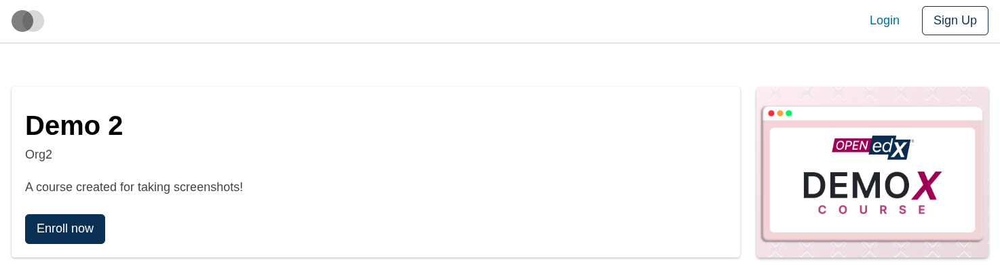
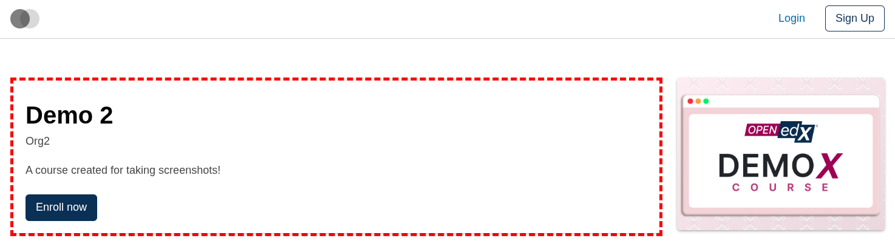
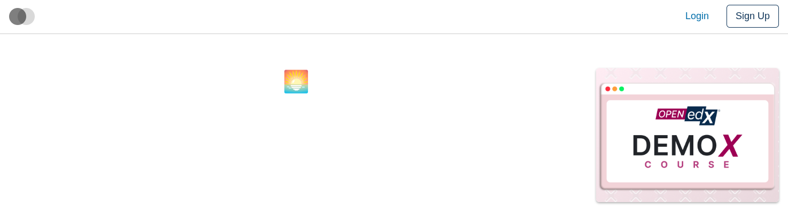
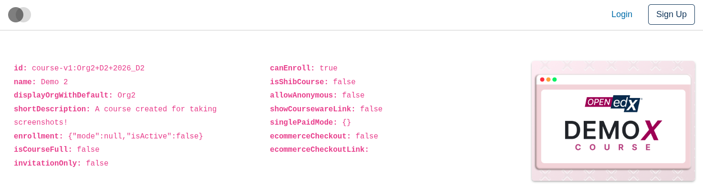

# Course About Intro Slot

### Slot ID: `org.openedx.frontend.slot.catalog.courseAboutIntro.v1`

### Slot Props

* `courseAboutData` — the full course-about data blob (course id/name/org, short description, enrollment state, ecommerce checkout link, etc.). See `CourseAboutDataPartial` for the exact shape.

## Description

This slot is used to replace/modify/hide the entire Course about page intro section.

## Examples

### Default content



### Wrapped with a red border (custom layout)



To keep the default content but wrap it in extra markup, replace the slot's **layout** (not its widget). The layout receives the widget list — which includes the synthetic `defaultContent` — and can render it inside anything.

```diff
-import { EnvironmentTypes, SiteConfig, ... } from '@openedx/frontend-base';
+import { EnvironmentTypes, LayoutOperationTypes, SiteConfig, useWidgets, ... } from '@openedx/frontend-base';

 import { catalogApp } from './src';

 import '@openedx/frontend-base/shell/style';

+const BorderedLayout = () => {
+  const widgets = useWidgets();
+  return <div style={{ border: 'thick dashed red' }}>{widgets}</div>;
+};
+
 const siteConfig: SiteConfig = {
   // ...
   apps: [
     // ...
     {
       ...catalogApp,
+      slots: [
+        {
+          slotId: 'org.openedx.frontend.slot.catalog.courseAboutIntro.v1',
+          op: LayoutOperationTypes.REPLACE,
+          component: BorderedLayout,
+        },
+      ],
     },
   ],
 };
```

### Replaced with a simple custom component



Add the following to your site config to replace the Course about page intro entirely (in this case with a centered "🌅" `h1` tag). The diff below is against this app's `site.config.dev.tsx`.

```diff
-import { EnvironmentTypes, SiteConfig, ... } from '@openedx/frontend-base';
+import { EnvironmentTypes, WidgetOperationTypes, SiteConfig, ... } from '@openedx/frontend-base';

 const siteConfig: SiteConfig = {
   // ...
   apps: [
     // ...
     {
       ...catalogApp,
+      slots: [
+        {
+          slotId: 'org.openedx.frontend.slot.catalog.courseAboutIntro.v1',
+          id: 'customCourseAboutIntro',
+          op: WidgetOperationTypes.REPLACE,
+          relatedId: 'defaultContent',
+          element: <h1 style={{ textAlign: 'center' }}>🌅</h1>,
+        },
+      ],
     },
   ],
 };
```

### Replaced with a custom component using the slot's `courseAboutData` prop



Add the following to your site config to replace the Course about page intro with a custom component that reads the slot's `courseAboutData` prop. The diff below is against this app's `site.config.dev.tsx`.

```diff
-import { EnvironmentTypes, SiteConfig, ... } from '@openedx/frontend-base';
+import { EnvironmentTypes, WidgetOperationTypes, SiteConfig, ... } from '@openedx/frontend-base';

-import { catalogApp } from './src';
+import { catalogApp, type CourseAboutIntroSlotProps } from './src';

+import { Container, Row, Col } from '@openedx/paragon';
+
 import '@openedx/frontend-base/shell/style';

+const customCourseAboutIntro = ({ courseAboutData }: CourseAboutIntroSlotProps) => (
+  <Container>
+    <Row>
+      <Col>
+        <code>
+          <b>id:</b> {courseAboutData.id}<br/>
+          <b>name:</b> {courseAboutData.name}<br/>
+          <b>displayOrgWithDefault:</b> {courseAboutData.displayOrgWithDefault}<br/>
+          <b>shortDescription:</b> {courseAboutData.shortDescription}<br/>
+          <b>enrollment:</b> {JSON.stringify(courseAboutData.enrollment)}<br/>
+          <b>isCourseFull:</b> {String(courseAboutData.isCourseFull)}<br/>
+          <b>invitationOnly:</b> {String(courseAboutData.invitationOnly)}<br/>
+        </code>
+      </Col>
+      <Col>
+        <code>
+          <b>canEnroll:</b> {String(courseAboutData.canEnroll)}<br/>
+          <b>isShibCourse:</b> {String(courseAboutData.isShibCourse)}<br/>
+          <b>allowAnonymous:</b> {String(courseAboutData.allowAnonymous)}<br/>
+          <b>showCoursewareLink:</b> {String(courseAboutData.showCoursewareLink)}<br/>
+          <b>singlePaidMode:</b> {JSON.stringify(courseAboutData.singlePaidMode)}<br/>
+          <b>ecommerceCheckout:</b> {String(courseAboutData.ecommerceCheckout)}<br/>
+          <b>ecommerceCheckoutLink:</b> {courseAboutData.ecommerceCheckoutLink}<br/>
+        </code>
+      </Col>
+    </Row>
+  </Container>
+);
+
 const siteConfig: SiteConfig = {
   // ...
   apps: [
     // ...
     {
       ...catalogApp,
+      slots: [
+        {
+          slotId: 'org.openedx.frontend.slot.catalog.courseAboutIntro.v1',
+          id: 'customCourseAboutIntro',
+          op: WidgetOperationTypes.REPLACE,
+          relatedId: 'defaultContent',
+          component: customCourseAboutIntro,
+        },
+      ],
     },
   ],
 };
```
