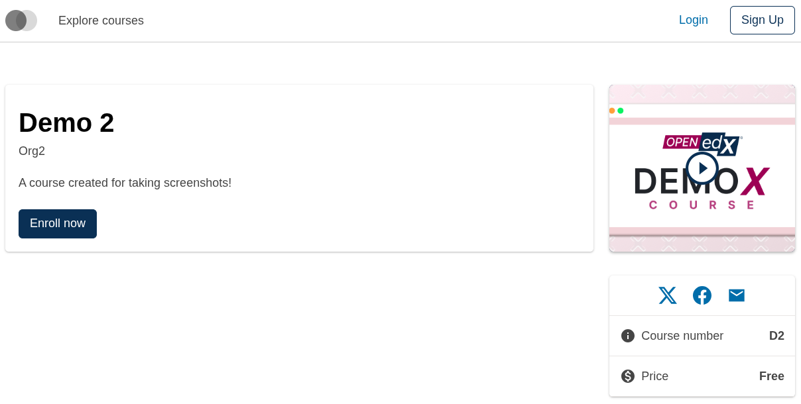
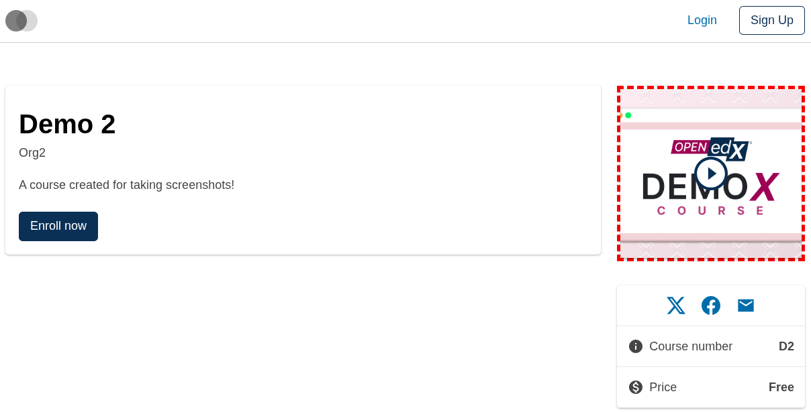
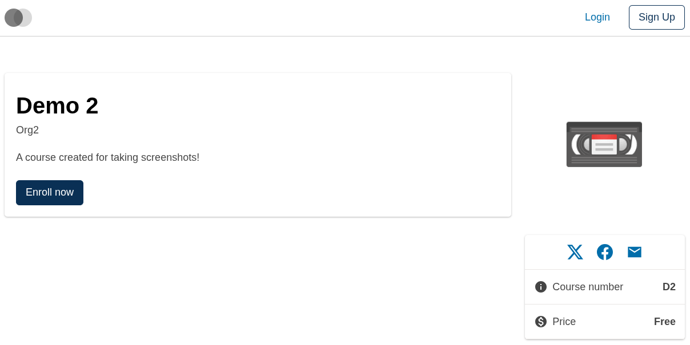
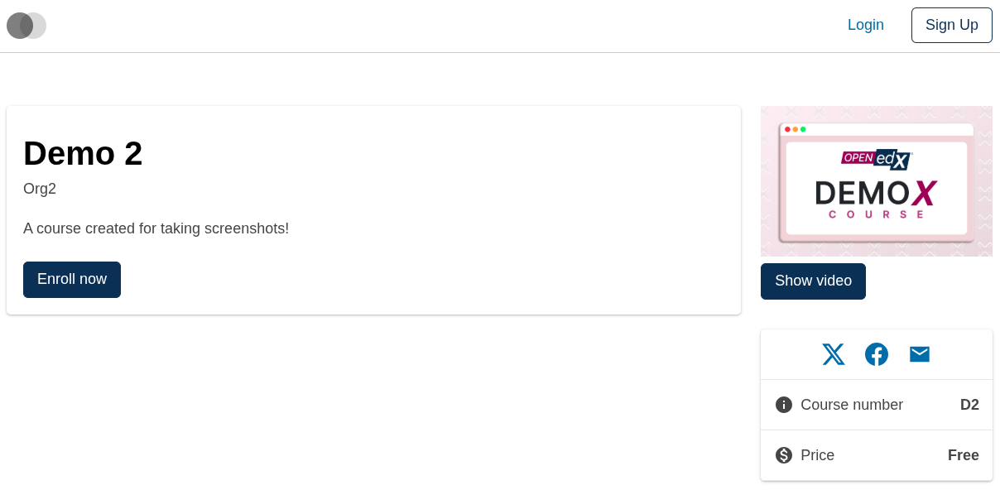

# Course About Intro Video Button Slot

### Slot ID: `org.openedx.frontend.slot.catalog.courseAboutIntroVideoButton.v1`

### Slot Props

* `courseImageSrc: string` — the src URL for the course image behind the play icon.
* `courseImageAltText: string` — alt text for the course image.
* `openVideoModal: () => void` — handler that opens the intro-video modal.

## Description

This slot is used to replace/modify/hide the entire Course about page intro video button.

## Examples

### Default content



### Wrapped with a red border (custom layout)



To keep the default content but wrap it in extra markup, replace the slot's **layout** (not its widget). The layout receives the widget list — which includes the synthetic `defaultContent` — and can render it inside anything.

```diff
-import { EnvironmentTypes, SiteConfig, ... } from '@openedx/frontend-base';
+import { EnvironmentTypes, LayoutOperationTypes, SiteConfig, useWidgets, ... } from '@openedx/frontend-base';

 import { catalogApp } from './src';

 import '@openedx/frontend-base/shell/style';

+const BorderedLayout = () => {
+  const widgets = useWidgets();
+  return <div style={{ border: 'thick dashed red' }}>{widgets}</div>;
+};
+
 const siteConfig: SiteConfig = {
   // ...
   apps: [
     // ...
     {
       ...catalogApp,
+      slots: [
+        {
+          slotId: 'org.openedx.frontend.slot.catalog.courseAboutIntroVideoButton.v1',
+          op: LayoutOperationTypes.REPLACE,
+          component: BorderedLayout,
+        },
+      ],
     },
   ],
 };
```

### Replaced with a simple custom component



Add the following to your site config to replace the Course about page intro video button entirely (in this case with a large "📼" `div`). The diff below is against this app's `site.config.dev.tsx`.

```diff
-import { EnvironmentTypes, SiteConfig, ... } from '@openedx/frontend-base';
+import { EnvironmentTypes, WidgetOperationTypes, SiteConfig, ... } from '@openedx/frontend-base';

 const siteConfig: SiteConfig = {
   // ...
   apps: [
     // ...
     {
       ...catalogApp,
+      slots: [
+        {
+          slotId: 'org.openedx.frontend.slot.catalog.courseAboutIntroVideoButton.v1',
+          id: 'customCourseAboutIntroVideoButton',
+          op: WidgetOperationTypes.REPLACE,
+          relatedId: 'defaultContent',
+          element: <div className="m-5.5 display-4">📼</div>,
+        },
+      ],
     },
   ],
 };
```

### Replaced with a custom component using the slot's props



Add the following to your site config to replace the Course about page intro video button with a custom component that renders the course image above a "Show video" button, using the slot's `courseImageSrc`, `courseImageAltText`, and `openVideoModal` props. The diff below is against this app's `site.config.dev.tsx`.

```diff
-import { EnvironmentTypes, SiteConfig, ... } from '@openedx/frontend-base';
+import { EnvironmentTypes, WidgetOperationTypes, SiteConfig, ... } from '@openedx/frontend-base';

-import { catalogApp } from './src';
+import { catalogApp, type CourseAboutIntroVideoButtonSlotProps } from './src';

+import { Button, Image } from '@openedx/paragon';
+
 import '@openedx/frontend-base/shell/style';

+const customIntroVideoButton = ({
+  courseImageSrc,
+  courseImageAltText,
+  openVideoModal,
+}: CourseAboutIntroVideoButtonSlotProps) => (
+  <>
+    <Image
+      className="mb-2"
+      width="100%"
+      src={courseImageSrc}
+      alt={courseImageAltText}
+    />
+    <Button onClick={openVideoModal}>
+      Show video
+    </Button>
+  </>
+);
+
 const siteConfig: SiteConfig = {
   // ...
   apps: [
     // ...
     {
       ...catalogApp,
+      slots: [
+        {
+          slotId: 'org.openedx.frontend.slot.catalog.courseAboutIntroVideoButton.v1',
+          id: 'customCourseAboutIntroVideoButton',
+          op: WidgetOperationTypes.REPLACE,
+          relatedId: 'defaultContent',
+          component: customIntroVideoButton,
+        },
+      ],
     },
   ],
 };
```
