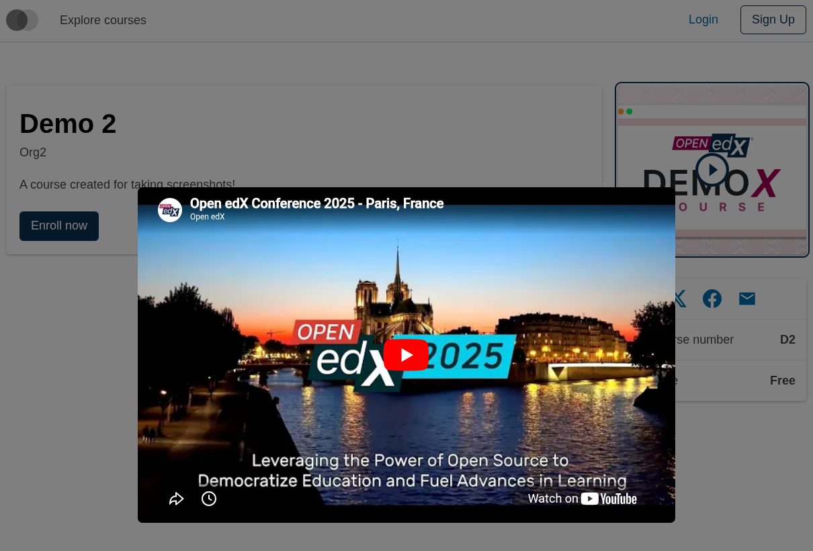
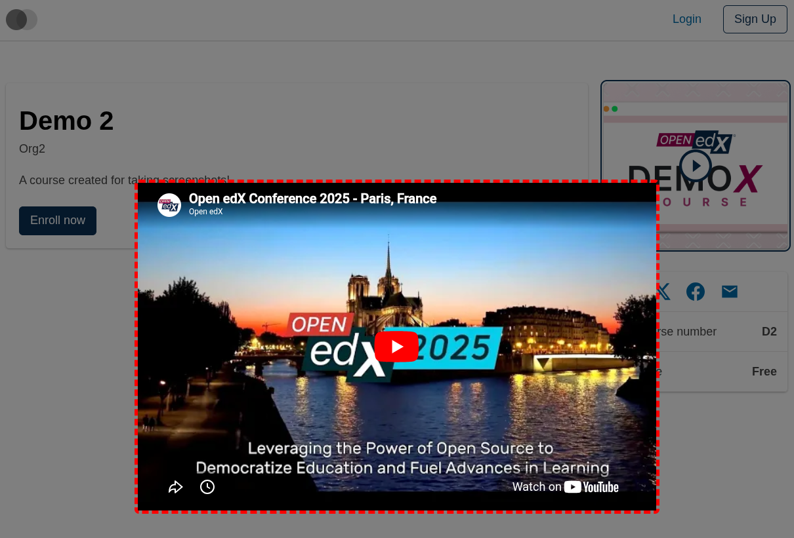
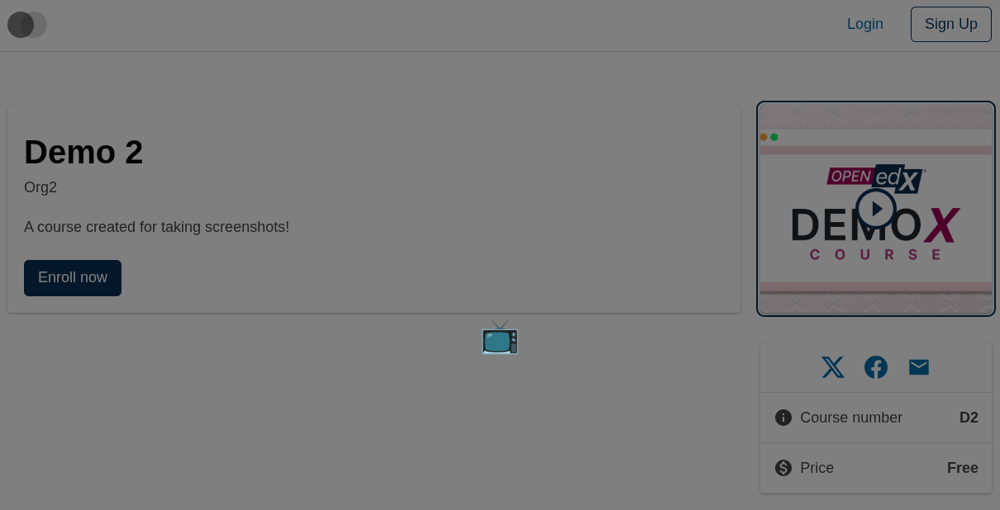
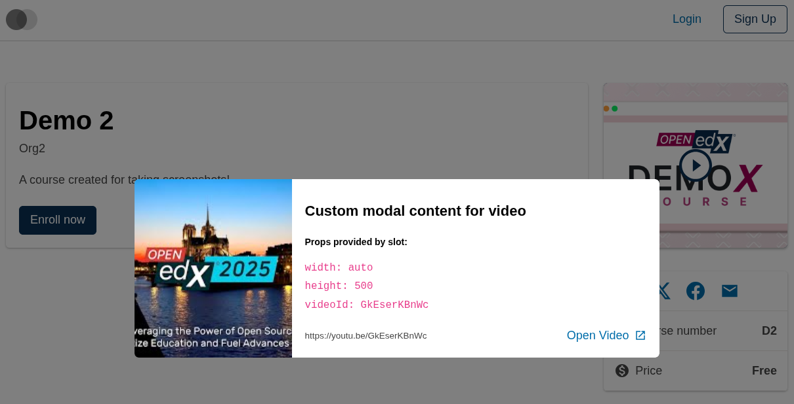

# Course About Intro Video Modal Content Slot

### Slot ID: `org.openedx.frontend.slot.catalog.courseAboutIntroVideoModalContent.v1`

### Slot Props

* `videoId: string` — the YouTube video ID for the embed.
* `width?: string` — optional iframe width override.
* `height?: number` — optional iframe height override.

## Description

This slot is used to replace/modify/hide the entire Course about page intro video modal content.

## Examples

### Default content



### Wrapped with a red border (custom layout)



To keep the default content but wrap it in extra markup, replace the slot's **layout** (not its widget). The layout receives the widget list — which includes the synthetic `defaultContent` — and can render it inside anything.

```diff
-import { EnvironmentTypes, SiteConfig, ... } from '@openedx/frontend-base';
+import { EnvironmentTypes, LayoutOperationTypes, SiteConfig, useWidgets, ... } from '@openedx/frontend-base';

 import { catalogApp } from './src';

 import '@openedx/frontend-base/shell/style';

+const BorderedLayout = () => {
+  const widgets = useWidgets();
+  return (
+    <div className="d-flex flex-column flex-fill" style={{ border: 'thick dashed red' }}>
+      {widgets}
+    </div>
+  );
+};
+
 const siteConfig: SiteConfig = {
   // ...
   apps: [
     // ...
     {
       ...catalogApp,
+      slots: [
+        {
+          slotId: 'org.openedx.frontend.slot.catalog.courseAboutIntroVideoModalContent.v1',
+          op: LayoutOperationTypes.REPLACE,
+          component: BorderedLayout,
+        },
+      ],
     },
   ],
 };
```

### Replaced with a simple custom component



Add the following to your site config to replace the Course about page intro video modal content entirely (in this case with a centered "📺" `h1` tag). The diff below is against this app's `site.config.dev.tsx`.

```diff
-import { EnvironmentTypes, SiteConfig, ... } from '@openedx/frontend-base';
+import { EnvironmentTypes, WidgetOperationTypes, SiteConfig, ... } from '@openedx/frontend-base';

 const siteConfig: SiteConfig = {
   // ...
   apps: [
     // ...
     {
       ...catalogApp,
+      slots: [
+        {
+          slotId: 'org.openedx.frontend.slot.catalog.courseAboutIntroVideoModalContent.v1',
+          id: 'customCourseAboutIntroVideoModalContent',
+          op: WidgetOperationTypes.REPLACE,
+          relatedId: 'defaultContent',
+          element: <h1 style={{ textAlign: 'center' }}>📺</h1>,
+        },
+      ],
     },
   ],
 };
```

### Replaced with a custom component using the slot's props



Add the following to your site config to replace the Course about page intro video modal content with a custom component that reads the slot's `videoId` prop. The diff below is against this app's `site.config.dev.tsx`.

```diff
-import { EnvironmentTypes, SiteConfig, ... } from '@openedx/frontend-base';
+import { EnvironmentTypes, WidgetOperationTypes, SiteConfig, ... } from '@openedx/frontend-base';

-import { catalogApp } from './src';
+import { catalogApp, type CourseAboutIntroVideoModalContentSlotProps } from './src';

 import '@openedx/frontend-base/shell/style';

+import { Card, Hyperlink } from '@openedx/paragon';
+
+const customModalContent = ({ videoId, width, height }: CourseAboutIntroVideoModalContentSlotProps) => (
+  <Card orientation="horizontal">
+    <Card.ImageCap
+      src={`https://img.youtube.com/vi/${videoId}/mqdefault.jpg`}
+      srcAlt="Video Thumbnail"
+    />
+    <Card.Body>
+      <Card.Header title="Custom modal content for video" />
+      <Card.Section title="Props provided by slot:">
+        <code>
+          width: {width}<br/>
+          height: {height}<br/>
+          videoId: {videoId}
+        </code>
+      </Card.Section>
+      <Card.Footer
+        orientation="vertical"
+        textElement={`https://youtu.be/${videoId}`}
+      >
+        <Hyperlink
+          destination={`https://youtu.be/${videoId}`}
+          target="_blank"
+        >
+          Open Video
+        </Hyperlink>
+      </Card.Footer>
+    </Card.Body>
+  </Card>
+);
+
 const siteConfig: SiteConfig = {
   // ...
   apps: [
     // ...
     {
       ...catalogApp,
+      slots: [
+        {
+          slotId: 'org.openedx.frontend.slot.catalog.courseAboutIntroVideoModalContent.v1',
+          id: 'customCourseAboutIntroVideoModalContent',
+          op: WidgetOperationTypes.REPLACE,
+          relatedId: 'defaultContent',
+          component: customModalContent,
+        },
+      ],
     },
   ],
 };
```
