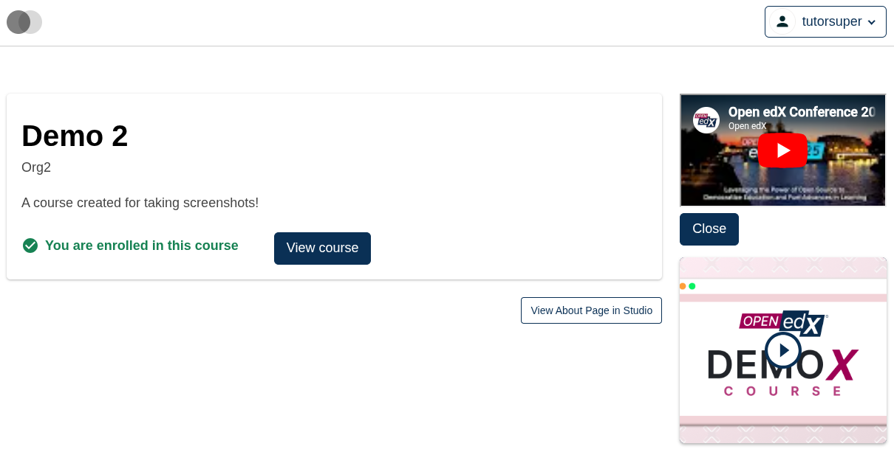

# Course About Intro Video Modal Slot

### Slot ID: `org.openedx.frontend.slot.catalog.courseAboutIntroVideoModal.v1`

### Slot Props

* `isOpen: boolean` — whether the modal is open.
* `close: () => void` — handler that closes the modal.
* `videoId: string` — the YouTube video ID to embed.

## Description

This slot is used to replace/modify/hide the entire Course about page intro video modal.

## Examples

### Default content


### Replaced with a custom modal using the slot's props



Add the following to your site config to replace the Course about page intro video modal with a custom modal that consumes the slot's `isOpen`, `close`, and `videoId` props. The diff below is against this app's `site.config.dev.tsx`.

```diff
-import { EnvironmentTypes, SiteConfig, ... } from '@openedx/frontend-base';
+import { EnvironmentTypes, WidgetOperationTypes, SiteConfig, ... } from '@openedx/frontend-base';

-import { catalogApp } from './src';
+import { catalogApp, type CourseAboutIntroVideoModalSlotProps } from './src';

+import { Button } from '@openedx/paragon';
+
 import '@openedx/frontend-base/shell/style';

+const customVideoModal = ({ isOpen, close, videoId }: CourseAboutIntroVideoModalSlotProps) => {
+  if (!isOpen) return null;
+  return (
+    <div className="mb-3">
+      <iframe
+        src={`https://www.youtube.com/embed/${videoId}`}
+        width="100%"
+        height="100%"
+        allowFullScreen
+      />
+      <Button onClick={close}>Close</Button>
+    </div>
+  );
+};
+
 const siteConfig: SiteConfig = {
   // ...
   apps: [
     // ...
     {
       ...catalogApp,
+      slots: [
+        {
+          slotId: 'org.openedx.frontend.slot.catalog.courseAboutIntroVideoModal.v1',
+          id: 'customCourseAboutIntroVideoModal',
+          op: WidgetOperationTypes.REPLACE,
+          relatedId: 'defaultContent',
+          component: customVideoModal,
+        },
+      ],
     },
   ],
 };
```
