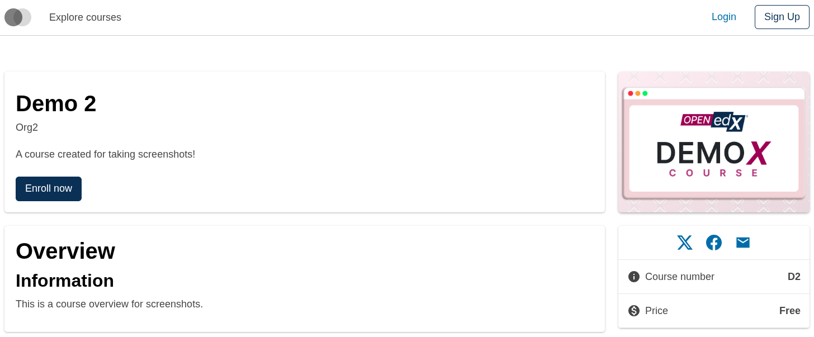
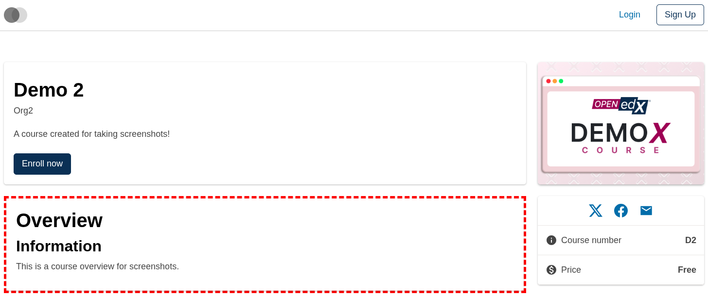
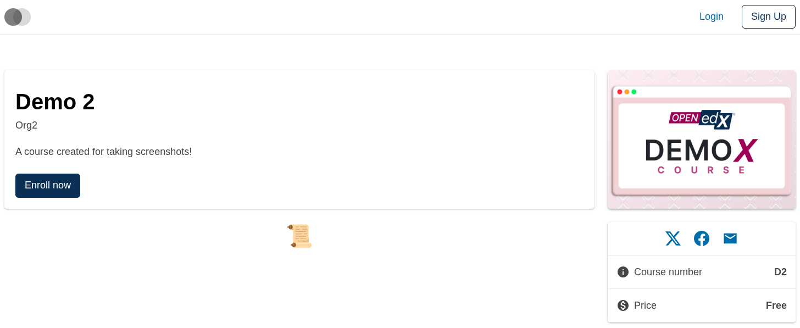
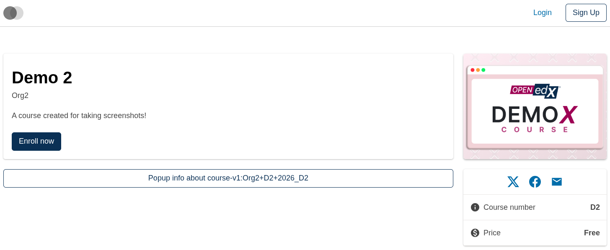
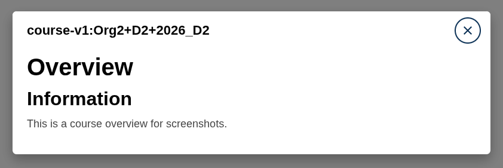

# Course About Overview Slot

### Slot ID: `org.openedx.frontend.slot.catalog.courseAboutOverview.v1`

### Slot Props

* `overviewData: string` — the course overview HTML content.
* `courseId: string` — the unique identifier of the course.

## Description

This slot is used to replace/modify/hide the entire course about overview section on the Course about page.

## Examples

### Default content



### Wrapped with a red border (custom layout)



To keep the default content but wrap it in extra markup, replace the slot's **layout** (not its widget). The layout receives the widget list — which includes the synthetic `defaultContent` — and can render it inside anything.

```diff
-import { EnvironmentTypes, SiteConfig, ... } from '@openedx/frontend-base';
+import { EnvironmentTypes, LayoutOperationTypes, SiteConfig, useWidgets, ... } from '@openedx/frontend-base';

 import { catalogApp } from './src';

 import '@openedx/frontend-base/shell/style';

+const BorderedLayout = () => {
+  const widgets = useWidgets();
+  return <div style={{ border: 'thick dashed red' }}>{widgets}</div>;
+};
+
 const siteConfig: SiteConfig = {
   // ...
   apps: [
     // ...
     {
       ...catalogApp,
+      slots: [
+        {
+          slotId: 'org.openedx.frontend.slot.catalog.courseAboutOverview.v1',
+          op: LayoutOperationTypes.REPLACE,
+          component: BorderedLayout,
+        },
+      ],
     },
   ],
 };
```

### Replaced with a simple custom component



Add the following to your site config to replace the Course about overview entirely (in this case with a centered "📜" `h1` tag). The diff below is against this app's `site.config.dev.tsx`.

```diff
-import { EnvironmentTypes, SiteConfig, ... } from '@openedx/frontend-base';
+import { EnvironmentTypes, WidgetOperationTypes, SiteConfig, ... } from '@openedx/frontend-base';

 const siteConfig: SiteConfig = {
   // ...
   apps: [
     // ...
     {
       ...catalogApp,
+      slots: [
+        {
+          slotId: 'org.openedx.frontend.slot.catalog.courseAboutOverview.v1',
+          id: 'customCourseAboutOverview',
+          op: WidgetOperationTypes.REPLACE,
+          relatedId: 'defaultContent',
+          element: <h1 style={{ textAlign: 'center' }}>📜</h1>,
+        },
+      ],
     },
   ],
 };
```

### Replaced with a custom component using the slot's props

**Trigger button (closed state):**



**Modal (open state):**



Add the following to your site config to replace the Course about overview with a modal-dialog component that reads the slot's `overviewData` and `courseId` props (open the modal via a button, render the overview HTML inside).

```diff
-import { EnvironmentTypes, SiteConfig, ... } from '@openedx/frontend-base';
+import { EnvironmentTypes, WidgetOperationTypes, SiteConfig, ... } from '@openedx/frontend-base';

-import { catalogApp } from './src';
+import { catalogApp, type CourseAboutOverviewSlotProps } from './src';

+import { useToggle, Button, ModalDialog } from '@openedx/paragon';
+
 import '@openedx/frontend-base/shell/style';

+const CourseOverviewModal = ({ overviewData, courseId }: CourseAboutOverviewSlotProps) => {
+  const [isOpen, open, close] = useToggle(false);
+  return (
+    <>
+      <Button variant="outline-primary" onClick={open}>
+        Popup info about {courseId}
+      </Button>
+      <ModalDialog
+        title="Course overview"
+        size="lg"
+        isOpen={isOpen}
+        onClose={close}
+        hasCloseButton
+        isFullscreenOnMobile
+        isOverflowVisible={false}
+      >
+        <ModalDialog.Header>
+          <ModalDialog.Title>{courseId}</ModalDialog.Title>
+        </ModalDialog.Header>
+        <ModalDialog.Body>
+          <div dangerouslySetInnerHTML={{ __html: overviewData }} />
+        </ModalDialog.Body>
+      </ModalDialog>
+    </>
+  );
+};
+
 const siteConfig: SiteConfig = {
   // ...
   apps: [
     // ...
     {
       ...catalogApp,
+      slots: [
+        {
+          slotId: 'org.openedx.frontend.slot.catalog.courseAboutOverview.v1',
+          id: 'customCourseAboutOverview',
+          op: WidgetOperationTypes.REPLACE,
+          relatedId: 'defaultContent',
+          component: CourseOverviewModal,
+        },
+      ],
     },
   ],
 };
```
