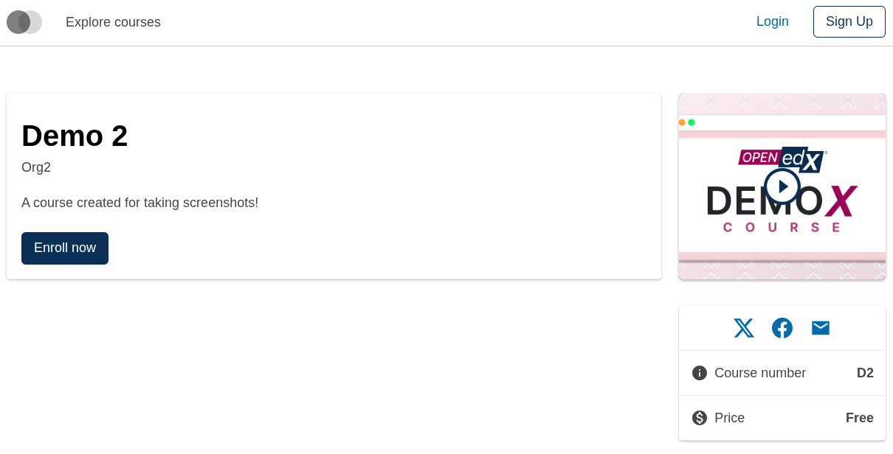
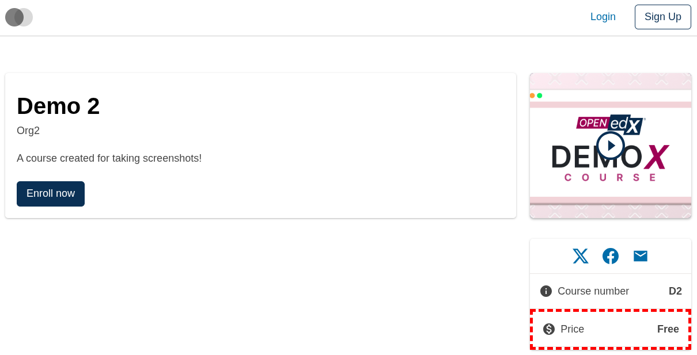
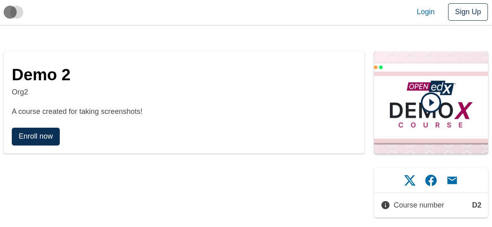
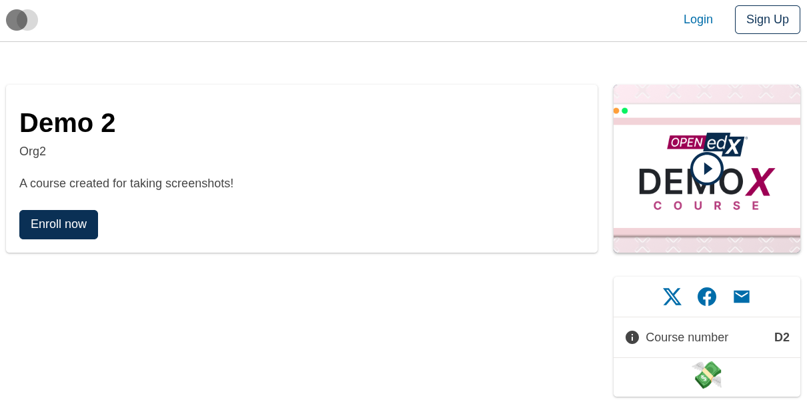
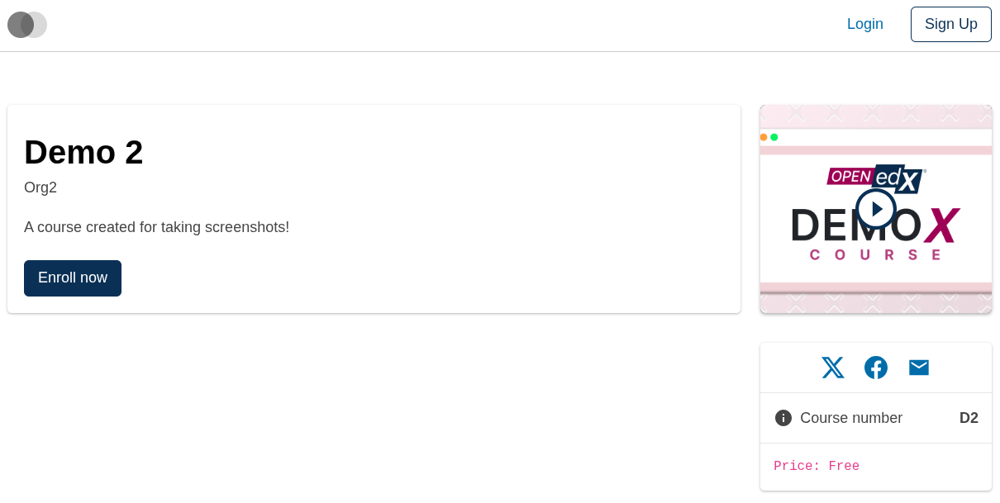

# Course About Sidebar Course Price Slot

### Slot ID: `org.openedx.frontend.slot.catalog.courseAboutSidebarCoursePrice.v1`

### Slot Props

* `coursePrice: string` — the formatted course price to display.

## Description

This slot is used to replace/modify/hide the entire Course about page course price sidebar block.

## Examples

### Default content



### Wrapped with a red border (custom layout)



To keep the default content but wrap it in extra markup, replace the slot's **layout**.

```diff
-import { EnvironmentTypes, SiteConfig, ... } from '@openedx/frontend-base';
+import { EnvironmentTypes, LayoutOperationTypes, SiteConfig, useWidgets, ... } from '@openedx/frontend-base';

 import { catalogApp } from './src';

 import '@openedx/frontend-base/shell/style';

+const BorderedLayout = () => {
+  const widgets = useWidgets();
+  return <div style={{ border: 'thick dashed red' }}>{widgets}</div>;
+};
+
 const siteConfig: SiteConfig = {
   // ...
   apps: [
     // ...
     {
       ...catalogApp,
+      slots: [
+        {
+          slotId: 'org.openedx.frontend.slot.catalog.courseAboutSidebarCoursePrice.v1',
+          op: LayoutOperationTypes.REPLACE,
+          component: BorderedLayout,
+        },
+      ],
     },
   ],
 };
```

### Hide the course price block



Legacy FPF had a dedicated `PLUGIN_OPERATIONS.Hide` op — in the new API the equivalent is a `REMOVE` operation against the default widget.

```diff
-import { EnvironmentTypes, SiteConfig, ... } from '@openedx/frontend-base';
+import { EnvironmentTypes, WidgetOperationTypes, SiteConfig, ... } from '@openedx/frontend-base';

 const siteConfig: SiteConfig = {
   // ...
   apps: [
     // ...
     {
       ...catalogApp,
+      slots: [
+        {
+          slotId: 'org.openedx.frontend.slot.catalog.courseAboutSidebarCoursePrice.v1',
+          op: WidgetOperationTypes.REMOVE,
+          relatedId: 'defaultContent',
+        },
+      ],
     },
   ],
 };
```

### Replaced with a simple custom component



Add the following to your site config to replace the sidebar course price block entirely (in this case with a centered "💸" `h1` tag).

```diff
-import { EnvironmentTypes, SiteConfig, ... } from '@openedx/frontend-base';
+import { EnvironmentTypes, WidgetOperationTypes, SiteConfig, ... } from '@openedx/frontend-base';

 const siteConfig: SiteConfig = {
   // ...
   apps: [
     // ...
     {
       ...catalogApp,
+      slots: [
+        {
+          slotId: 'org.openedx.frontend.slot.catalog.courseAboutSidebarCoursePrice.v1',
+          id: 'customCourseAboutSidebarCoursePrice',
+          op: WidgetOperationTypes.REPLACE,
+          relatedId: 'defaultContent',
+          element: <h1 style={{ textAlign: 'center' }}>💸</h1>,
+        },
+      ],
     },
   ],
 };
```

### Replaced with a custom component using the slot's `coursePrice` prop



Add the following to your site config to replace the sidebar course price block with a custom component that reads the slot's `coursePrice` prop.

```diff
-import { EnvironmentTypes, SiteConfig, ... } from '@openedx/frontend-base';
+import { EnvironmentTypes, WidgetOperationTypes, SiteConfig, ... } from '@openedx/frontend-base';

-import { catalogApp } from './src';
+import { catalogApp, type CourseAboutSidebarCoursePriceSlotProps } from './src';

 import '@openedx/frontend-base/shell/style';

+const customCoursePrice = ({ coursePrice }: CourseAboutSidebarCoursePriceSlotProps) => (
+  <code className="p-3">
+    Price: {coursePrice}
+  </code>
+);
+
 const siteConfig: SiteConfig = {
   // ...
   apps: [
     // ...
     {
       ...catalogApp,
+      slots: [
+        {
+          slotId: 'org.openedx.frontend.slot.catalog.courseAboutSidebarCoursePrice.v1',
+          id: 'customCourseAboutSidebarCoursePrice',
+          op: WidgetOperationTypes.REPLACE,
+          relatedId: 'defaultContent',
+          component: customCoursePrice,
+        },
+      ],
     },
   ],
 };
```
