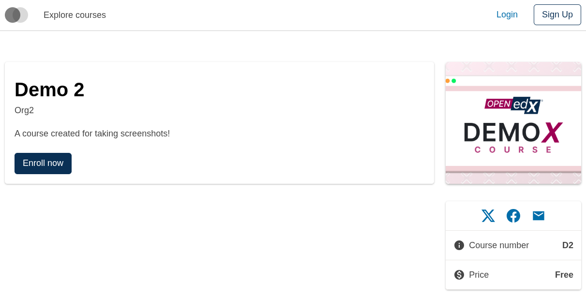
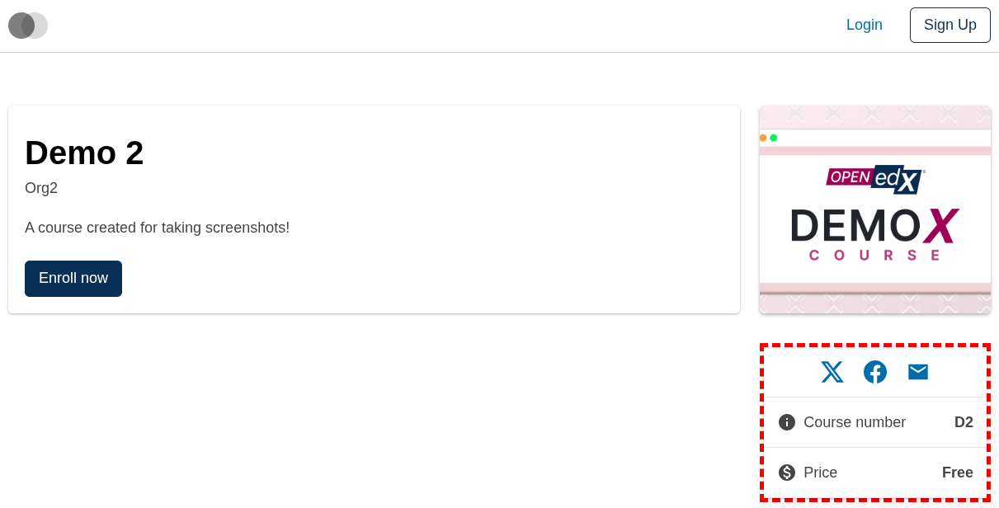
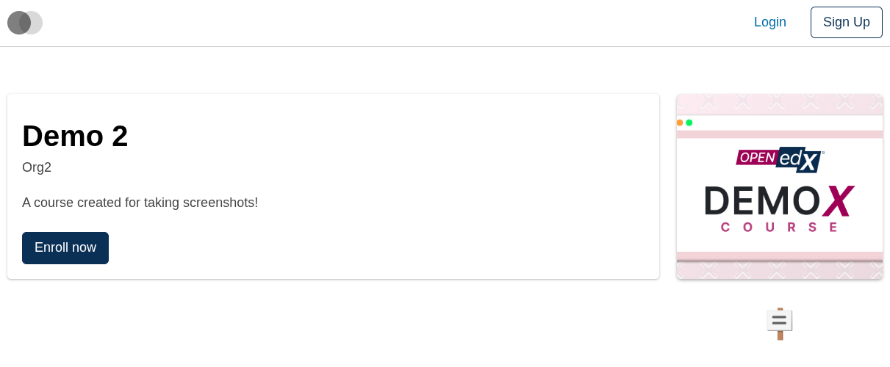
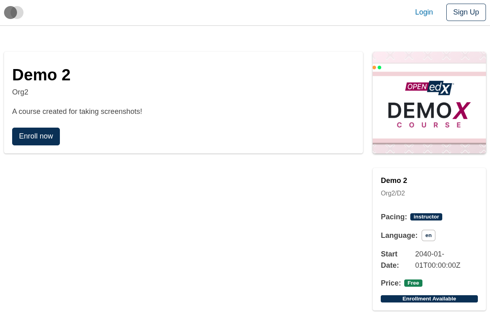

# Course About Sidebar Slot

### Slot ID: `org.openedx.frontend.slot.catalog.courseAboutSidebar.v1`

### Slot Props

* `courseAboutData: CourseAboutData` — the full course-about data object (id, name, start/end dates, enrollment details, media, pricing, prerequisites, and other course metadata).

## Description

This slot is used to replace/modify/hide the entire Course about page sidebar.

## Examples

### Default content



### Wrapped with a red border (custom layout)



To keep the default content but wrap it in extra markup, replace the slot's **layout** (not its widget). The layout receives the widget list — which includes the synthetic `defaultContent` — and can render it inside anything.

```diff
-import { EnvironmentTypes, SiteConfig, ... } from '@openedx/frontend-base';
+import { EnvironmentTypes, LayoutOperationTypes, SiteConfig, useWidgets, ... } from '@openedx/frontend-base';

 import { catalogApp } from './src';

 import '@openedx/frontend-base/shell/style';

+const BorderedLayout = () => {
+  const widgets = useWidgets();
+  return <div style={{ border: 'thick dashed red' }}>{widgets}</div>;
+};
+
 const siteConfig: SiteConfig = {
   // ...
   apps: [
     // ...
     {
       ...catalogApp,
+      slots: [
+        {
+          slotId: 'org.openedx.frontend.slot.catalog.courseAboutSidebar.v1',
+          op: LayoutOperationTypes.REPLACE,
+          component: BorderedLayout,
+        },
+      ],
     },
   ],
 };
```

### Replaced with a simple custom component



Add the following to your site config to replace the Course about page sidebar entirely (in this case with a centered "🪧" `h1` tag). The diff below is against this app's `site.config.dev.tsx`.

```diff
-import { EnvironmentTypes, SiteConfig, ... } from '@openedx/frontend-base';
+import { EnvironmentTypes, WidgetOperationTypes, SiteConfig, ... } from '@openedx/frontend-base';

 const siteConfig: SiteConfig = {
   // ...
   apps: [
     // ...
     {
       ...catalogApp,
+      slots: [
+        {
+          slotId: 'org.openedx.frontend.slot.catalog.courseAboutSidebar.v1',
+          id: 'customCourseAboutSidebar',
+          op: WidgetOperationTypes.REPLACE,
+          relatedId: 'defaultContent',
+          element: <h1 style={{ textAlign: 'center' }}>🪧</h1>,
+        },
+      ],
     },
   ],
 };
```

### Replaced with a custom component using the slot's `courseAboutData` prop



Add the following to your site config to replace the Course about page sidebar with a custom component that displays key course info in a simplified format with badges and highlights. The diff below is against this app's `site.config.dev.tsx`.

```diff
-import { EnvironmentTypes, SiteConfig, ... } from '@openedx/frontend-base';
+import { EnvironmentTypes, WidgetOperationTypes, SiteConfig, ... } from '@openedx/frontend-base';

-import { catalogApp } from './src';
+import { catalogApp, type CourseAboutSidebarSlotProps } from './src';

+import { Card, Badge, Stack, Chip } from '@openedx/paragon';
+
 import '@openedx/frontend-base/shell/style';

+const customSidebar = ({ courseAboutData }: CourseAboutSidebarSlotProps) => {
+  if (!courseAboutData) { return null; }
+  return (
+    <Card>
+      <Card.Section>
+        <Stack gap={3}>
+          <div>
+            <h4>{courseAboutData.name}</h4>
+            <p className="text-muted small">
+              {courseAboutData.displayOrgWithDefault}/{courseAboutData.displayNumberWithDefault}
+            </p>
+          </div>
+          {courseAboutData.effort && (
+            <Stack direction="horizontal" gap={2}>
+              <strong>Effort:</strong> {courseAboutData.effort}
+            </Stack>
+          )}
+          {courseAboutData.pacing && (
+            <Stack direction="horizontal" gap={2}>
+              <strong>Pacing:</strong> <Badge>{courseAboutData.pacing}</Badge>
+            </Stack>
+          )}
+          {courseAboutData.language && (
+            <Stack direction="horizontal" gap={2}>
+              <strong>Language:</strong> <Chip>{courseAboutData.language}</Chip>
+            </Stack>
+          )}
+          {courseAboutData.start && (
+            <Stack direction="horizontal" gap={2}>
+              <strong>Start Date:</strong> {courseAboutData.startDisplay || courseAboutData.start}
+            </Stack>
+          )}
+          {courseAboutData.coursePrice && (
+            <Stack direction="horizontal" gap={2}>
+              <strong>Price:</strong> <Badge variant="success">{courseAboutData.coursePrice}</Badge>
+            </Stack>
+          )}
+          {courseAboutData.canEnroll && (
+            <Badge>Enrollment Available</Badge>
+          )}
+        </Stack>
+      </Card.Section>
+    </Card>
+  );
+};
+
 const siteConfig: SiteConfig = {
   // ...
   apps: [
     // ...
     {
       ...catalogApp,
+      slots: [
+        {
+          slotId: 'org.openedx.frontend.slot.catalog.courseAboutSidebar.v1',
+          id: 'customCourseAboutSidebar',
+          op: WidgetOperationTypes.REPLACE,
+          relatedId: 'defaultContent',
+          component: customSidebar,
+        },
+      ],
     },
   ],
 };
```
