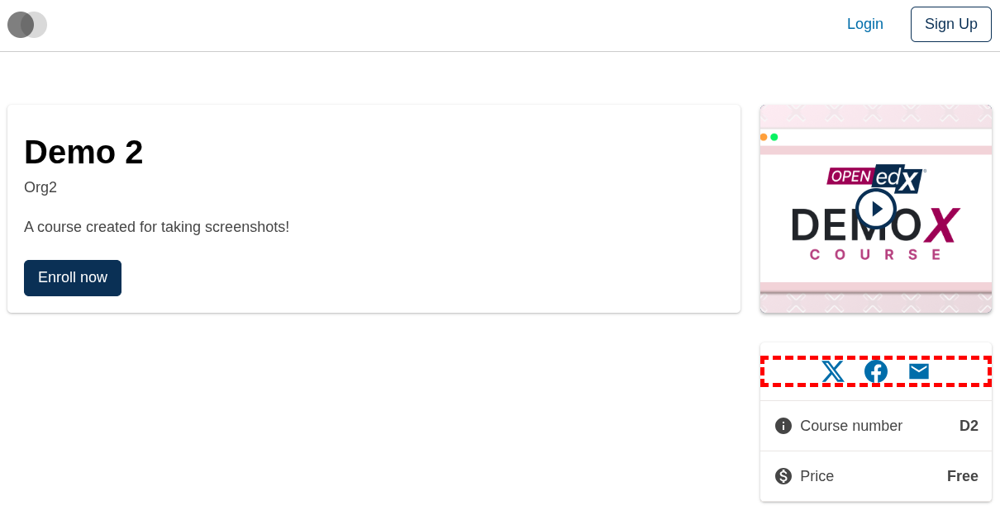
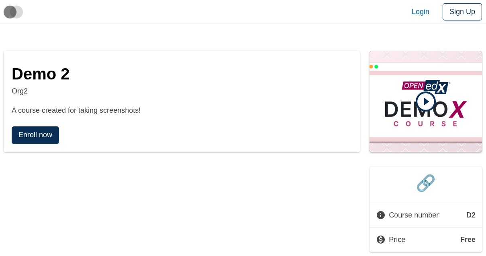
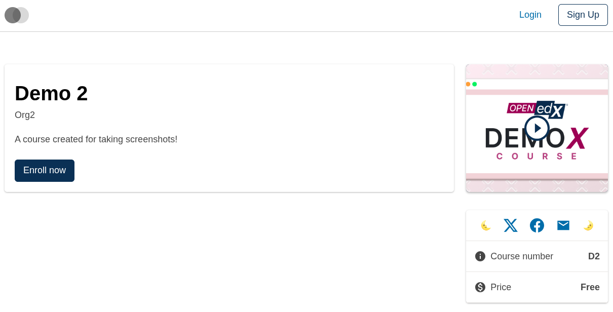
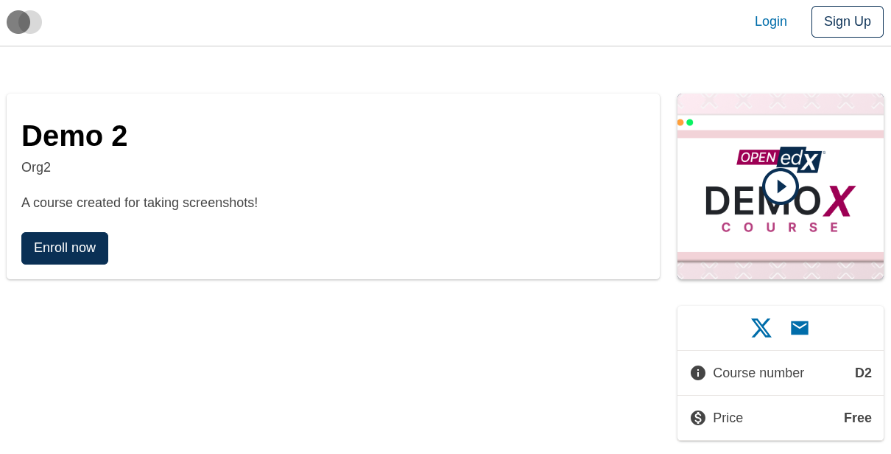
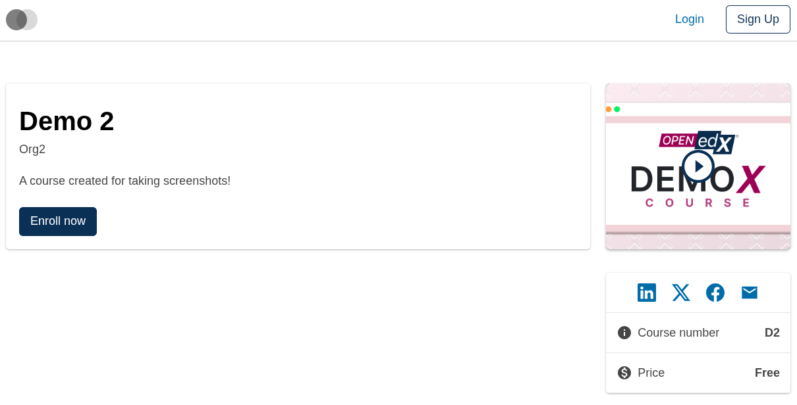
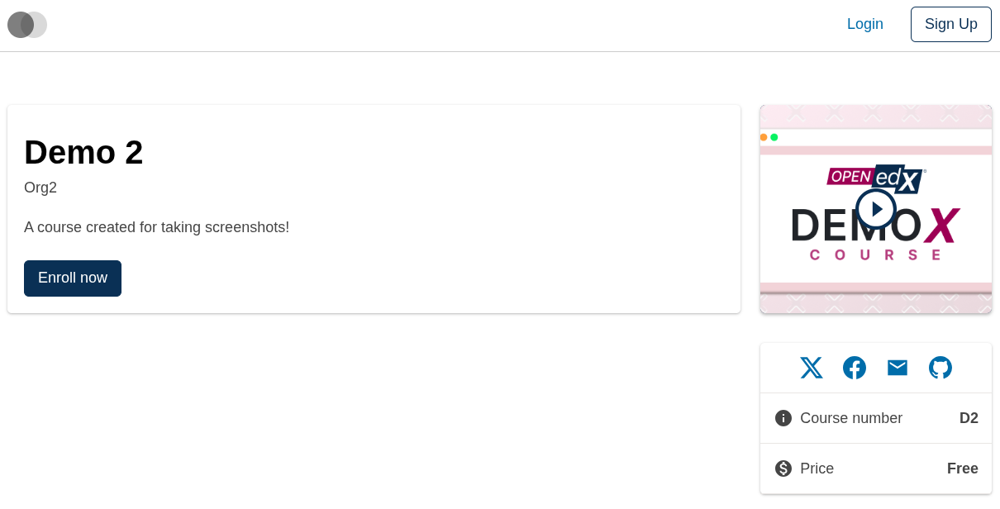

# Course About Sidebar Social Slot

### Slot ID: `org.openedx.frontend.slot.catalog.courseAboutSidebarSocial.v1`

### Slot Props

* `socialLinks: SocialLink[]` — the default set of social sharing links to render.

### Widget Options

The slot's default widget (id `defaultContent`) reads `useWidgetOptions()` so customizers can override the rendered list without replacing the widget itself:

* `socialLinks?: SocialLink[] | ((current: SocialLink[]) => SocialLink[])` — either a full replacement array, or a function that receives the current list and returns a new one (mirrors the legacy `PLUGIN_OPERATIONS.Modify` shape).

Where `SocialLink` is:

```ts
interface SocialLink {
  id: string;
  destination: string;
  icon: typeof Icon;         // paragon Icon component
  screenReaderText: string;
}
```

## Description

This slot is used to replace/modify/hide the entire Course about page sidebar social links.

## Examples

### Default content


### Wrapped with a red border (custom layout)



To keep the default content but wrap it in extra markup, replace the slot's **layout**. Because this slot's default layout is a horizontal `Stack` (not just `<>{widgets}</>`), the custom layout has to reproduce the Stack to preserve the horizontal arrangement of the icons.

```diff
-import { EnvironmentTypes, SiteConfig, ... } from '@openedx/frontend-base';
+import { EnvironmentTypes, LayoutOperationTypes, SiteConfig, useWidgets, ... } from '@openedx/frontend-base';

 import { catalogApp } from './src';

+import { Stack } from '@openedx/paragon';
+
 import '@openedx/frontend-base/shell/style';

+const BorderedSocialLayout = () => {
+  const widgets = useWidgets();
+  return (
+    <Stack
+      className="justify-content-center my-3"
+      direction="horizontal"
+      gap={4}
+      style={{ border: 'thick dashed red' }}
+    >
+      {widgets}
+    </Stack>
+  );
+};
+
 const siteConfig: SiteConfig = {
   // ...
   apps: [
     // ...
     {
       ...catalogApp,
+      slots: [
+        {
+          slotId: 'org.openedx.frontend.slot.catalog.courseAboutSidebarSocial.v1',
+          op: LayoutOperationTypes.REPLACE,
+          component: BorderedSocialLayout,
+        },
+      ],
     },
   ],
 };
```

### Replaced with a simple custom component



Add the following to your site config to replace the sidebar social links entirely (in this case with a centered "🔗" `h1` tag).

```diff
-import { EnvironmentTypes, SiteConfig, ... } from '@openedx/frontend-base';
+import { EnvironmentTypes, WidgetOperationTypes, SiteConfig, ... } from '@openedx/frontend-base';

 const siteConfig: SiteConfig = {
   // ...
   apps: [
     // ...
     {
       ...catalogApp,
+      slots: [
+        {
+          slotId: 'org.openedx.frontend.slot.catalog.courseAboutSidebarSocial.v1',
+          id: 'customCourseAboutSidebarSocial',
+          op: WidgetOperationTypes.REPLACE,
+          relatedId: 'defaultContent',
+          element: <h1 style={{ textAlign: 'center' }}>🔗</h1>,
+        },
+      ],
     },
   ],
 };
```

### Add arbitrary widgets before and after the defaults



Because the default layout renders every widget inside the same horizontal `Stack`, `PREPEND` and `APPEND` operations land additional **widgets** adjacent to the default `<SocialLinks>`. Use this when you want to add arbitrary components (not `SocialLink`-shaped entries) alongside the defaults.

```diff
-import { EnvironmentTypes, SiteConfig, ... } from '@openedx/frontend-base';
+import { EnvironmentTypes, WidgetOperationTypes, SiteConfig, ... } from '@openedx/frontend-base';

 const siteConfig: SiteConfig = {
   // ...
   apps: [
     // ...
     {
       ...catalogApp,
+      slots: [
+        {
+          slotId: 'org.openedx.frontend.slot.catalog.courseAboutSidebarSocial.v1',
+          id: 'moonLeft',
+          op: WidgetOperationTypes.PREPEND,
+          element: <span>🌜</span>,
+        },
+        {
+          slotId: 'org.openedx.frontend.slot.catalog.courseAboutSidebarSocial.v1',
+          id: 'moonRight',
+          op: WidgetOperationTypes.APPEND,
+          element: <span>🌛</span>,
+        },
+      ],
     },
   ],
 };
```

### Replace the entire social links list via widget options


Use `WidgetOperationTypes.OPTIONS` against `defaultContent` to hand the default widget a new `socialLinks` array. The default `<SocialLinks>` renders your list instead of the caller-provided one.

```diff
-import { EnvironmentTypes, SiteConfig, ... } from '@openedx/frontend-base';
+import { EnvironmentTypes, WidgetOperationTypes, SiteConfig, ... } from '@openedx/frontend-base';

 import { catalogApp } from './src';

+import {
+  BsGithub,
+  BsLinkedin,
+  BsPlaystation,
+} from '@openedx/paragon/icons';
+
 import '@openedx/frontend-base/shell/style';

 const siteConfig: SiteConfig = {
   // ...
   apps: [
     // ...
     {
       ...catalogApp,
+      slots: [
+        {
+          slotId: 'org.openedx.frontend.slot.catalog.courseAboutSidebarSocial.v1',
+          op: WidgetOperationTypes.OPTIONS,
+          relatedId: 'defaultContent',
+          options: {
+            socialLinks: [
+              {
+                id: 'linkedin',
+                destination: 'https://linkedin.com/share',
+                icon: BsLinkedin,
+                screenReaderText: 'Share on LinkedIn',
+              },
+              {
+                id: 'playstation',
+                destination: 'https://playstation.com',
+                icon: BsPlaystation,
+                screenReaderText: 'Share on Playstation',
+              },
+              {
+                id: 'github',
+                destination: 'https://github.com',
+                icon: BsGithub,
+                screenReaderText: 'Share on GitHub',
+              },
+            ],
+          },
+        },
+      ],
     },
   ],
 };
```

### Modify the social links list via widget options (function form)

The `socialLinks` option can also be a **function** that receives the current list and returns a new one — useful when you want to keep the defaults (which are computed at render time from course data) and just tweak them.

**Remove an item**



```diff
-import { EnvironmentTypes, SiteConfig, ... } from '@openedx/frontend-base';
+import { EnvironmentTypes, WidgetOperationTypes, SiteConfig, ... } from '@openedx/frontend-base';

 const siteConfig: SiteConfig = {
   // ...
   apps: [
     // ...
     {
       ...catalogApp,
+      slots: [
+        {
+          slotId: 'org.openedx.frontend.slot.catalog.courseAboutSidebarSocial.v1',
+          op: WidgetOperationTypes.OPTIONS,
+          relatedId: 'defaultContent',
+          options: {
+            socialLinks: (current) => current.filter((link) => link.id !== 'facebook'),
+          },
+        },
+      ],
     },
   ],
 };
```

**Prepend an item**



```diff
-import { EnvironmentTypes, SiteConfig, ... } from '@openedx/frontend-base';
+import { EnvironmentTypes, WidgetOperationTypes, SiteConfig, ... } from '@openedx/frontend-base';

+import { BsLinkedin } from '@openedx/paragon/icons';
+
 const siteConfig: SiteConfig = {
   // ...
   apps: [
     // ...
     {
       ...catalogApp,
+      slots: [
+        {
+          slotId: 'org.openedx.frontend.slot.catalog.courseAboutSidebarSocial.v1',
+          op: WidgetOperationTypes.OPTIONS,
+          relatedId: 'defaultContent',
+          options: {
+            socialLinks: (current) => [
+              {
+                id: 'linkedin',
+                destination: 'https://linkedin.com/share',
+                icon: BsLinkedin,
+                screenReaderText: 'Share on LinkedIn',
+              },
+              ...current,
+            ],
+          },
+        },
+      ],
     },
   ],
 };
```

**Append an item**



```diff
-import { EnvironmentTypes, SiteConfig, ... } from '@openedx/frontend-base';
+import { EnvironmentTypes, WidgetOperationTypes, SiteConfig, ... } from '@openedx/frontend-base';

+import { BsGithub } from '@openedx/paragon/icons';
+
 const siteConfig: SiteConfig = {
   // ...
   apps: [
     // ...
     {
       ...catalogApp,
+      slots: [
+        {
+          slotId: 'org.openedx.frontend.slot.catalog.courseAboutSidebarSocial.v1',
+          op: WidgetOperationTypes.OPTIONS,
+          relatedId: 'defaultContent',
+          options: {
+            socialLinks: (current) => [
+              ...current,
+              {
+                id: 'github',
+                destination: 'https://github.com',
+                icon: BsGithub,
+                screenReaderText: 'Share on GitHub',
+              },
+            ],
+          },
+        },
+      ],
     },
   ],
 };
```

