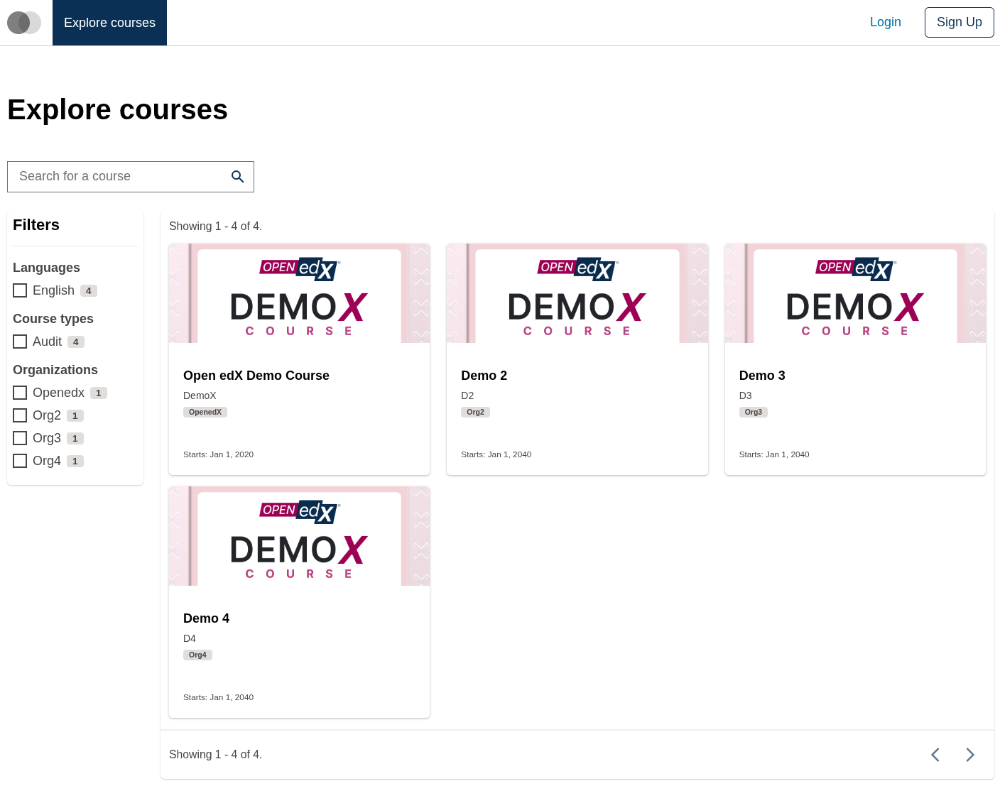
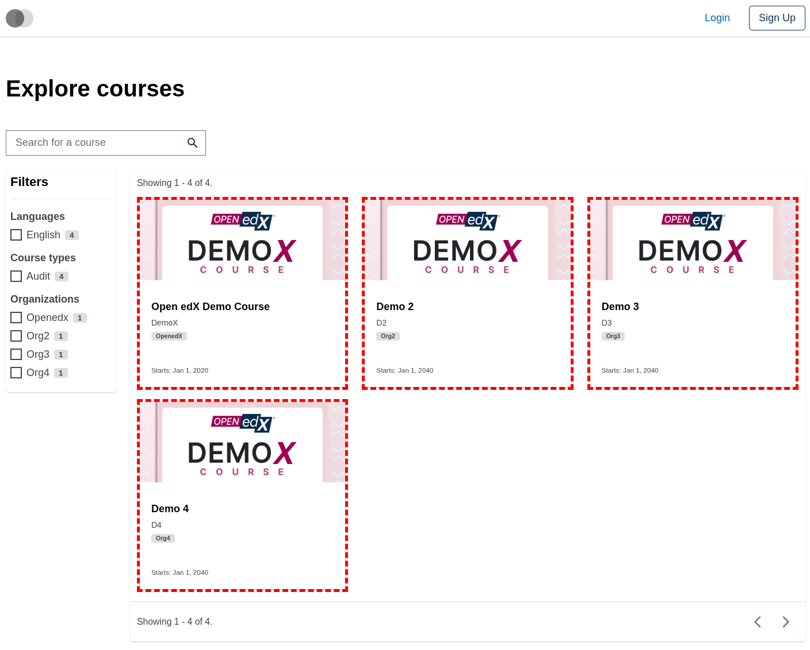
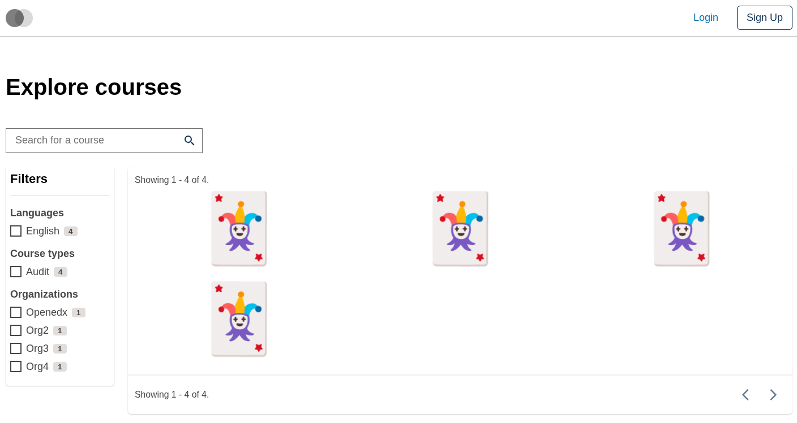
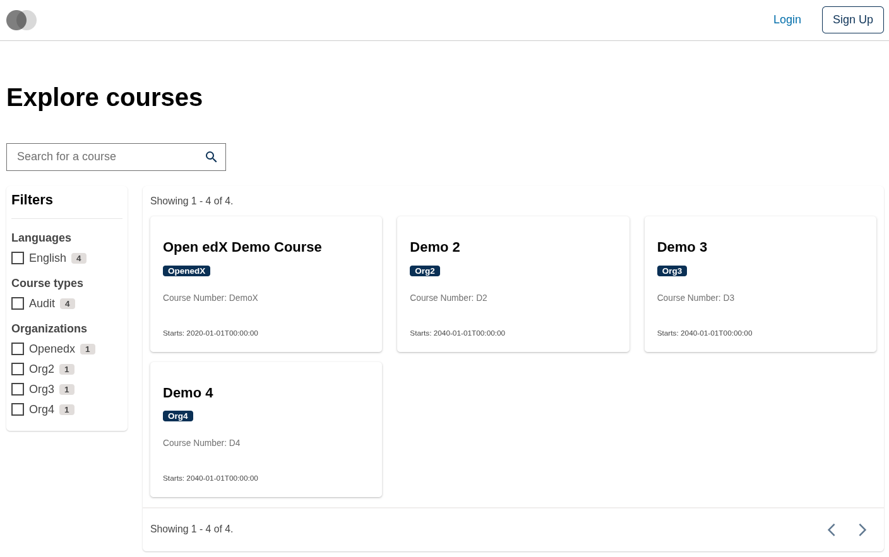

# Course Catalog Data Table Course Card Slot

### Slot ID: `org.openedx.frontend.slot.catalog.courseCatalogDataTableCourseCard.v1`

### Slot Props

* `isLoading?: boolean` — whether the card is in a loading state.
* `courseId?: string` — the course's unique identifier.
* `courseOrg?: string` — the organization offering the course.
* `courseName?: string` — the course's display name.
* `courseNumber?: string` — the course number.
* `courseImageUrl?: string` — URL of the course image.
* `courseStartDate?: string` — the course's start date in ISO format.
* `courseAdvertisedStart?: string` — the course's advertised start date.

## Description

This slot is used to replace/modify/hide the entire Course catalog page data table course card.

## Examples

### Default content



### Wrapped with a red border (custom layout)



To keep the default content but wrap it in extra markup, replace the slot's **layout**.

```diff
-import { EnvironmentTypes, SiteConfig, ... } from '@openedx/frontend-base';
+import { EnvironmentTypes, LayoutOperationTypes, SiteConfig, useWidgets, ... } from '@openedx/frontend-base';

 import { catalogApp } from './src';

 import '@openedx/frontend-base/shell/style';

+const BorderedLayout = () => {
+  const widgets = useWidgets();
+  return (
+    <div className="d-flex flex-column flex-fill" style={{ border: 'thick dashed red' }}>
+      {widgets}
+    </div>
+  );
+};
+
 const siteConfig: SiteConfig = {
   // ...
   apps: [
     // ...
     {
       ...catalogApp,
+      slots: [
+        {
+          slotId: 'org.openedx.frontend.slot.catalog.courseCatalogDataTableCourseCard.v1',
+          op: LayoutOperationTypes.REPLACE,
+          component: BorderedLayout,
+        },
+      ],
     },
   ],
 };
```

### Replaced with a simple custom component



Add the following to your site config to replace the course card entirely (in this case with a large "🃏" `div`).

```diff
-import { EnvironmentTypes, SiteConfig, ... } from '@openedx/frontend-base';
+import { EnvironmentTypes, WidgetOperationTypes, SiteConfig, ... } from '@openedx/frontend-base';

 const siteConfig: SiteConfig = {
   // ...
   apps: [
     // ...
     {
       ...catalogApp,
+      slots: [
+        {
+          slotId: 'org.openedx.frontend.slot.catalog.courseCatalogDataTableCourseCard.v1',
+          id: 'customCourseCatalogDataTableCourseCard',
+          op: WidgetOperationTypes.REPLACE,
+          relatedId: 'defaultContent',
+          element: <div className="d-flex align-items-center justify-content-center flex-fill pb-4 display-4">🃏</div>,
+        },
+      ],
     },
   ],
 };
```

### Replaced with a custom component using the slot's props



Add the following to your site config to replace the course card with a custom card that uses the slot's props.

```diff
-import { EnvironmentTypes, SiteConfig, ... } from '@openedx/frontend-base';
+import { EnvironmentTypes, WidgetOperationTypes, SiteConfig, ... } from '@openedx/frontend-base';

-import { catalogApp } from './src';
+import { catalogApp, type CourseCatalogDataTableCourseCardSlotProps } from './src';

+import { Card, Badge } from '@openedx/paragon';
+import { Link } from 'react-router-dom';
+
 import '@openedx/frontend-base/shell/style';

+const customCourseCard = ({
+  isLoading,
+  courseId,
+  courseOrg,
+  courseName,
+  courseNumber,
+  courseStartDate,
+}: CourseCatalogDataTableCourseCardSlotProps) => {
+  if (isLoading) { return <Card isLoading />; }
+  if (!courseId) { return null; }
+
+  return (
+    <Card as={Link} to={`/catalog/courses/${courseId}/about`} isClickable>
+      <Card.Header
+        title={courseName}
+        subtitle={<Badge>{courseOrg}</Badge>}
+      />
+      <Card.Section>
+        <p className="text-muted small">Course Number: {courseNumber}</p>
+      </Card.Section>
+      <Card.Footer textElement={courseStartDate ? `Starts: ${courseStartDate}` : ''} />
+    </Card>
+  );
+};
+
 const siteConfig: SiteConfig = {
   // ...
   apps: [
     // ...
     {
       ...catalogApp,
+      slots: [
+        {
+          slotId: 'org.openedx.frontend.slot.catalog.courseCatalogDataTableCourseCard.v1',
+          id: 'customCourseCatalogDataTableCourseCard',
+          op: WidgetOperationTypes.REPLACE,
+          relatedId: 'defaultContent',
+          component: customCourseCard,
+        },
+      ],
     },
   ],
 };
```
