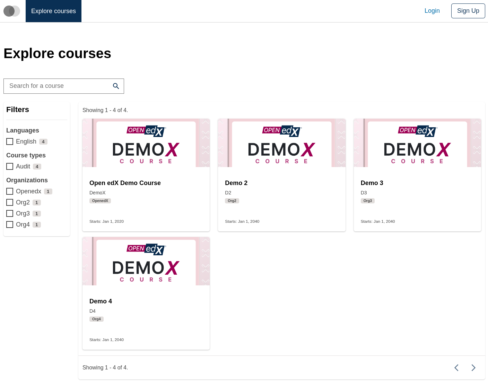
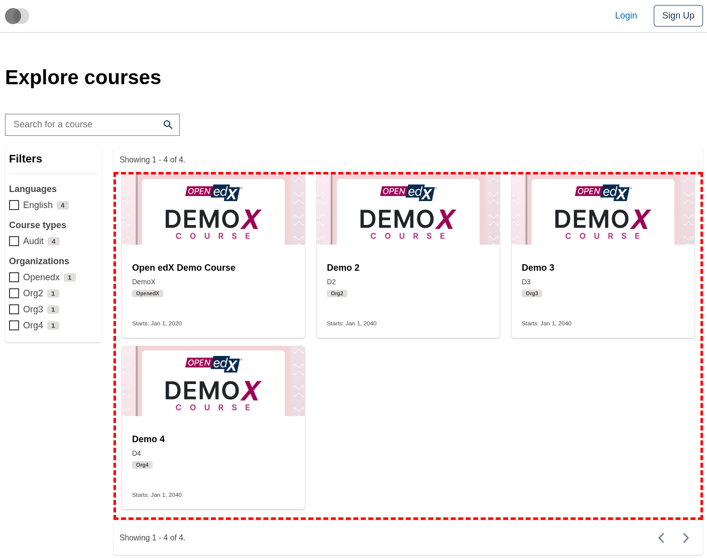
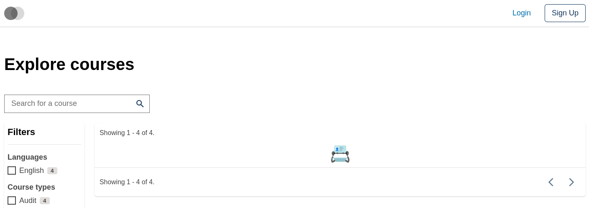
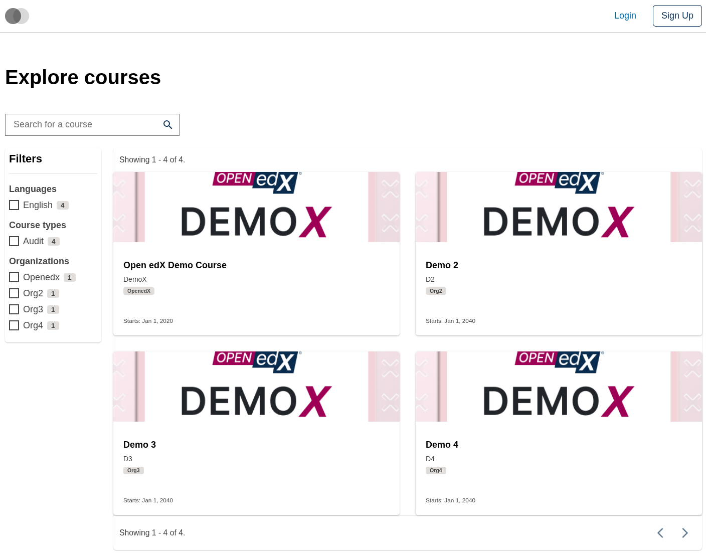

# Course Catalog Data Table Card View Slot

### Slot ID: `org.openedx.frontend.slot.catalog.courseCatalogDataTableCardView.v1`

### Slot Props

* `displayData?: CourseListSearchResponse` — the course list search response (results, total count, aggregations, and other metadata).

## Description

This slot is used to replace/modify/hide the entire Course catalog page data table card view section.

## Examples

### Default content



### Wrapped with a red border (custom layout)



To keep the default content but wrap it in extra markup, replace the slot's **layout**.

```diff
-import { EnvironmentTypes, SiteConfig, ... } from '@openedx/frontend-base';
+import { EnvironmentTypes, LayoutOperationTypes, SiteConfig, useWidgets, ... } from '@openedx/frontend-base';

 import { catalogApp } from './src';

 import '@openedx/frontend-base/shell/style';

+const BorderedLayout = () => {
+  const widgets = useWidgets();
+  return <div style={{ border: 'thick dashed red' }}>{widgets}</div>;
+};
+
 const siteConfig: SiteConfig = {
   // ...
   apps: [
     // ...
     {
       ...catalogApp,
+      slots: [
+        {
+          slotId: 'org.openedx.frontend.slot.catalog.courseCatalogDataTableCardView.v1',
+          op: LayoutOperationTypes.REPLACE,
+          component: BorderedLayout,
+        },
+      ],
     },
   ],
 };
```

### Replaced with a simple custom component



Add the following to your site config to replace the card view entirely (in this case with a centered "📇" `h1` tag).

```diff
-import { EnvironmentTypes, SiteConfig, ... } from '@openedx/frontend-base';
+import { EnvironmentTypes, WidgetOperationTypes, SiteConfig, ... } from '@openedx/frontend-base';

 const siteConfig: SiteConfig = {
   // ...
   apps: [
     // ...
     {
       ...catalogApp,
+      slots: [
+        {
+          slotId: 'org.openedx.frontend.slot.catalog.courseCatalogDataTableCardView.v1',
+          id: 'customCourseCatalogDataTableCardView',
+          op: WidgetOperationTypes.REPLACE,
+          relatedId: 'defaultContent',
+          element: <h1 style={{ textAlign: 'center' }}>📇</h1>,
+        },
+      ],
     },
   ],
 };
```

### Replaced with a custom component using the slot's `displayData` prop



Add the following to your site config to replace the card view with a custom 2-column grid that maps over `displayData.results` and renders each course through the standard course card slot.

```diff
-import { EnvironmentTypes, SiteConfig, ... } from '@openedx/frontend-base';
+import { EnvironmentTypes, WidgetOperationTypes, SiteConfig, ... } from '@openedx/frontend-base';

-import { catalogApp } from './src';
+import { catalogApp, type CourseCatalogDataTableCardViewSlotProps } from './src';

+import CourseCatalogDataTableCourseCardSlot from '@src/slots/CourseCatalogDataTableSlots/CourseCatalogDataTableCardViewSlot/CourseCatalogDataTableCourseCardSlot';
+
 import '@openedx/frontend-base/shell/style';

+const customCardView = ({ displayData }: CourseCatalogDataTableCardViewSlotProps) => {
+  if (!displayData?.results) { return null; }
+  return (
+    <div style={{ display: 'grid', gridTemplateColumns: 'repeat(2, 1fr)', gap: '2rem' }}>
+      {displayData.results.map((course) => (
+        <CourseCatalogDataTableCourseCardSlot
+          key={course.id}
+          original={course}
+          isLoading={false}
+        />
+      ))}
+    </div>
+  );
+};
+
 const siteConfig: SiteConfig = {
   // ...
   apps: [
     // ...
     {
       ...catalogApp,
+      slots: [
+        {
+          slotId: 'org.openedx.frontend.slot.catalog.courseCatalogDataTableCardView.v1',
+          id: 'customCourseCatalogDataTableCardView',
+          op: WidgetOperationTypes.REPLACE,
+          relatedId: 'defaultContent',
+          component: customCardView,
+        },
+      ],
     },
   ],
 };
```
