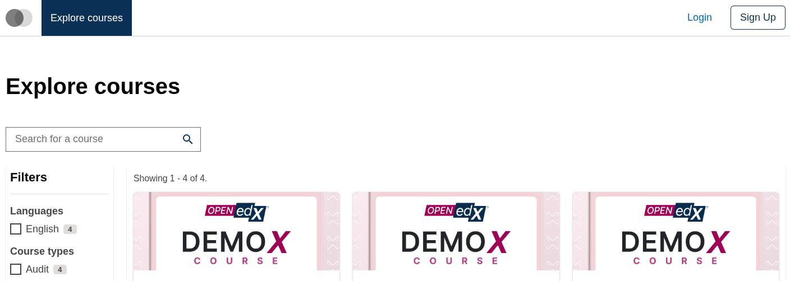
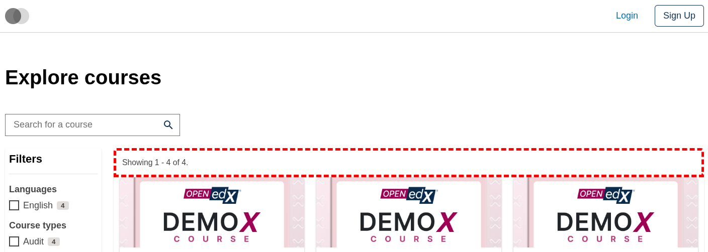
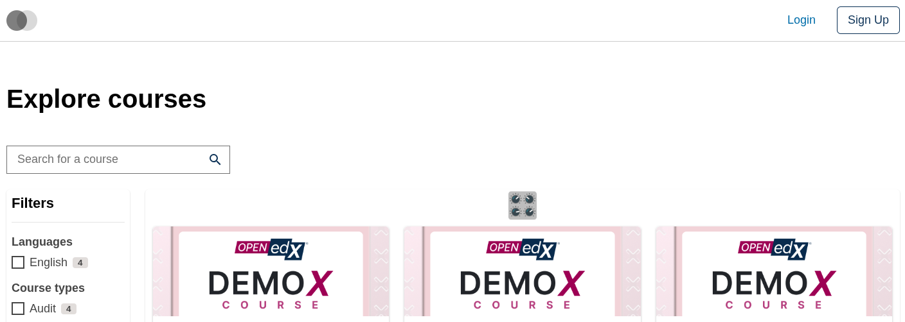
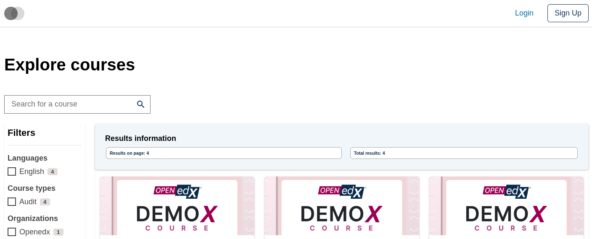

# Course Catalog Data Table Control Bar Slot

### Slot ID: `org.openedx.frontend.slot.catalog.courseCatalogDataTableControlBar.v1`

### Slot Props

* `currentPageResultsCount: number` — the number of results displayed on the current page.
* `totalResultsCount: number` — the total number of search results available.

## Description

This slot is used to replace/modify/hide the entire Course catalog page data table control bar.

## Examples

### Default content



### Wrapped with a red border (custom layout)



To keep the default content but wrap it in extra markup, replace the slot's **layout**.

```diff
-import { EnvironmentTypes, SiteConfig, ... } from '@openedx/frontend-base';
+import { EnvironmentTypes, LayoutOperationTypes, SiteConfig, useWidgets, ... } from '@openedx/frontend-base';

 import { catalogApp } from './src';

 import '@openedx/frontend-base/shell/style';

+const BorderedLayout = () => {
+  const widgets = useWidgets();
+  return <div style={{ border: 'thick dashed red' }}>{widgets}</div>;
+};
+
 const siteConfig: SiteConfig = {
   // ...
   apps: [
     // ...
     {
       ...catalogApp,
+      slots: [
+        {
+          slotId: 'org.openedx.frontend.slot.catalog.courseCatalogDataTableControlBar.v1',
+          op: LayoutOperationTypes.REPLACE,
+          component: BorderedLayout,
+        },
+      ],
     },
   ],
 };
```

### Replaced with a simple custom component



Add the following to your site config to replace the Course catalog control bar entirely (in this case with a centered "🎛️" `h1` tag).

```diff
-import { EnvironmentTypes, SiteConfig, ... } from '@openedx/frontend-base';
+import { EnvironmentTypes, WidgetOperationTypes, SiteConfig, ... } from '@openedx/frontend-base';

 const siteConfig: SiteConfig = {
   // ...
   apps: [
     // ...
     {
       ...catalogApp,
+      slots: [
+        {
+          slotId: 'org.openedx.frontend.slot.catalog.courseCatalogDataTableControlBar.v1',
+          id: 'customCourseCatalogDataTableControlBar',
+          op: WidgetOperationTypes.REPLACE,
+          relatedId: 'defaultContent',
+          element: <h1 style={{ textAlign: 'center' }}>🎛️</h1>,
+        },
+      ],
     },
   ],
 };
```

### Replaced with a custom component using the slot's props



Add the following to your site config to replace the Course catalog control bar with an alert component that reads the slot's `currentPageResultsCount` and `totalResultsCount` props.

```diff
-import { EnvironmentTypes, SiteConfig, ... } from '@openedx/frontend-base';
+import { EnvironmentTypes, WidgetOperationTypes, SiteConfig, ... } from '@openedx/frontend-base';

-import { catalogApp } from './src';
+import { catalogApp, type CourseCatalogDataTableControlBarSlotProps } from './src';

+import { Alert, Stack, Chip } from '@openedx/paragon';
+
 import '@openedx/frontend-base/shell/style';

+const customControlBar = ({
+  currentPageResultsCount,
+  totalResultsCount,
+}: CourseCatalogDataTableControlBarSlotProps) => (
+  <Alert variant="info">
+    <Alert.Heading>Results information</Alert.Heading>
+    <Stack direction="horizontal" gap={3}>
+      <Chip>Results on page: {currentPageResultsCount}</Chip>
+      <Chip>Total results: {totalResultsCount}</Chip>
+    </Stack>
+  </Alert>
+);
+
 const siteConfig: SiteConfig = {
   // ...
   apps: [
     // ...
     {
       ...catalogApp,
+      slots: [
+        {
+          slotId: 'org.openedx.frontend.slot.catalog.courseCatalogDataTableControlBar.v1',
+          id: 'customCourseCatalogDataTableControlBar',
+          op: WidgetOperationTypes.REPLACE,
+          relatedId: 'defaultContent',
+          component: customControlBar,
+        },
+      ],
     },
   ],
 };
```
