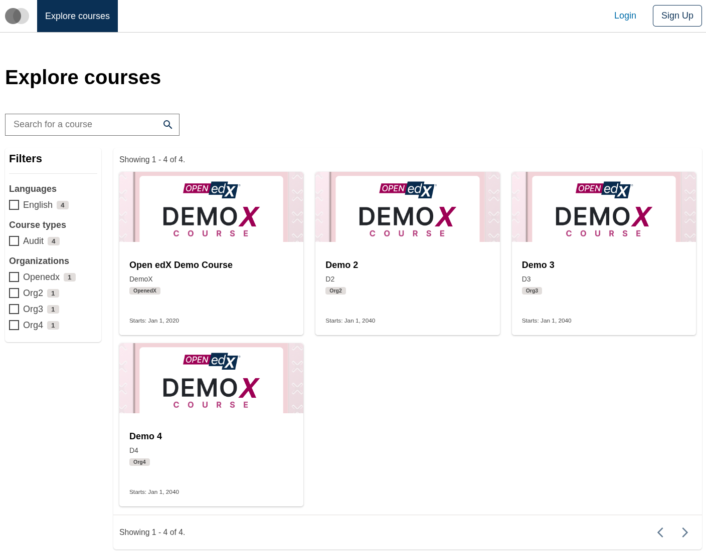
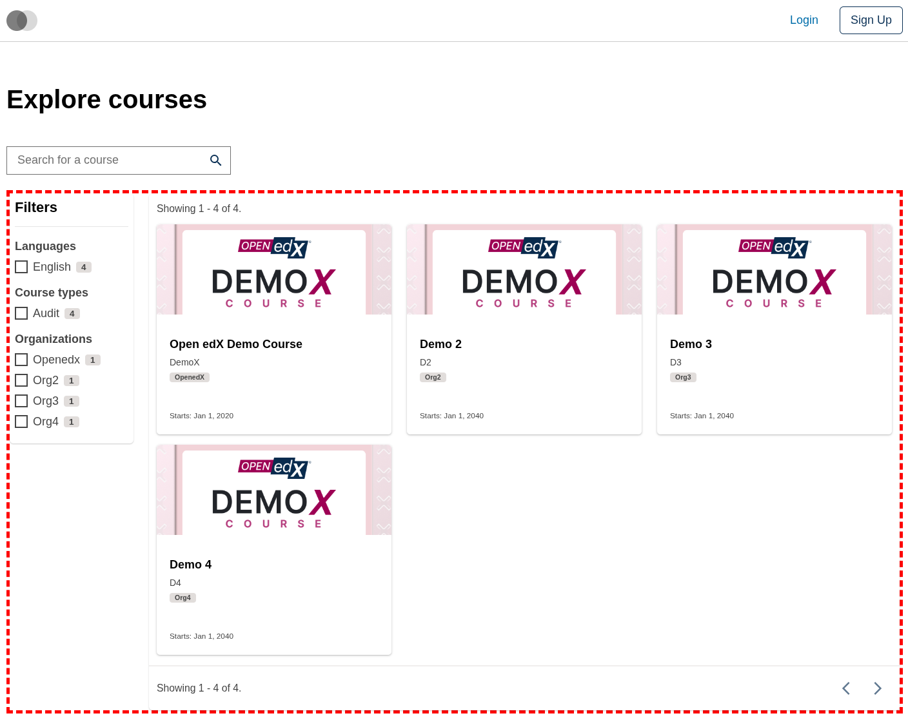
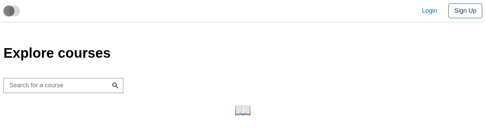
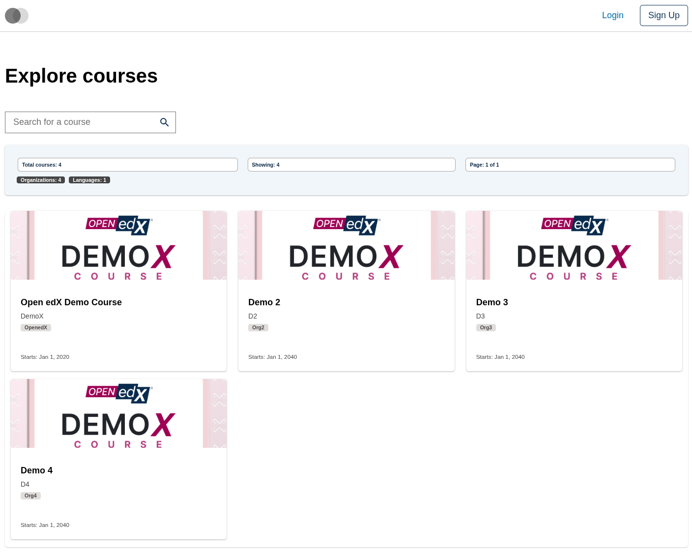

# Course Catalog Data Table Slot

### Slot ID: `org.openedx.frontend.slot.catalog.courseCatalogDataTable.v1`

### Slot Props

* `displayData?: CourseListSearchResponse` — the course list search response containing results, total count, aggregations, and other metadata.
* `totalCourses: number` — the total number of courses available in the catalog.
* `pageCount: number` — the total number of pages available for pagination, calculated from total courses and page size.
* `pageIndex: number` — the zero-based index of the currently active page in the table.
* `tableColumns: TableColumn[]` — column definitions for the table (headers, accessors, filters, filter choices). Generated from course aggregations.
* `handleFetchData: (params: DataTableParams) => void` — invoke when pagination / sorting / filtering changes so the caller can refetch data.

## Description

This slot is used to replace/modify/hide the entire Course catalog page data table.

## Examples

### Default content



### Wrapped with a red border (custom layout)



To keep the default content but wrap it in extra markup, replace the slot's **layout**.

```diff
-import { EnvironmentTypes, SiteConfig, ... } from '@openedx/frontend-base';
+import { EnvironmentTypes, LayoutOperationTypes, SiteConfig, useWidgets, ... } from '@openedx/frontend-base';

 import { catalogApp } from './src';

 import '@openedx/frontend-base/shell/style';

+const BorderedLayout = () => {
+  const widgets = useWidgets();
+  return <div style={{ border: 'thick dashed red' }}>{widgets}</div>;
+};
+
 const siteConfig: SiteConfig = {
   // ...
   apps: [
     // ...
     {
       ...catalogApp,
+      slots: [
+        {
+          slotId: 'org.openedx.frontend.slot.catalog.courseCatalogDataTable.v1',
+          op: LayoutOperationTypes.REPLACE,
+          component: BorderedLayout,
+        },
+      ],
     },
   ],
 };
```

### Replaced with a simple custom component



Add the following to your site config to replace the Course catalog data table entirely (in this case with a centered "📊" `h1` tag).

```diff
-import { EnvironmentTypes, SiteConfig, ... } from '@openedx/frontend-base';
+import { EnvironmentTypes, WidgetOperationTypes, SiteConfig, ... } from '@openedx/frontend-base';

 const siteConfig: SiteConfig = {
   // ...
   apps: [
     // ...
     {
       ...catalogApp,
+      slots: [
+        {
+          slotId: 'org.openedx.frontend.slot.catalog.courseCatalogDataTable.v1',
+          id: 'customCourseCatalogDataTable',
+          op: WidgetOperationTypes.REPLACE,
+          relatedId: 'defaultContent',
+          element: <h1 style={{ textAlign: 'center' }}>📖</h1>,
+        },
+      ],
     },
   ],
 };
```

### Replaced with a custom component using the slot's props



Add the following to your site config to replace the Course catalog data table with a custom component that displays a stats panel (totals, current page, aggregation counts) above a `CardView`-rendered course list. The diff below is against this app's `site.config.dev.tsx`.

```diff
-import { EnvironmentTypes, SiteConfig, ... } from '@openedx/frontend-base';
+import { EnvironmentTypes, WidgetOperationTypes, SiteConfig, ... } from '@openedx/frontend-base';

-import { catalogApp } from './src';
+import { catalogApp, type CourseCatalogDataTableSlotProps } from './src';

+import { useState } from 'react';
+import { DataTable, TextFilter, CardView, Alert, Stack, Chip, Badge } from '@openedx/paragon';
+
+import { DEFAULT_PAGE_SIZE } from '@src/data/course-list-search/constants';
+import { CourseCatalogDataTableCourseCardSlot } from '@src/slots/CourseCatalogDataTableSlots';
+
 import '@openedx/frontend-base/shell/style';

+const customDataTable = ({
+  displayData,
+  totalCourses,
+  pageCount,
+  pageIndex,
+  tableColumns,
+  handleFetchData,
+}: CourseCatalogDataTableSlotProps) => {
+  const coursesCount = displayData?.results?.length ?? 0;
+  const total = displayData?.total ?? totalCourses;
+  const currentPage = pageIndex + 1;
+  const aggs = displayData?.aggs;
+  const orgCount = aggs?.org?.terms ? Object.keys(aggs.org.terms).length : 0;
+  const languageCount = aggs?.language?.terms ? Object.keys(aggs.language.terms).length : 0;
+
+  return (
+    <Stack gap={3}>
+      <Alert variant="info">
+        <Stack gap={2}>
+          <Stack direction="horizontal" gap={3}>
+            <Chip>Total courses: {total}</Chip>
+            <Chip>Showing: {coursesCount}</Chip>
+            <Chip>Page: {currentPage} of {pageCount}</Chip>
+          </Stack>
+          {(orgCount > 0 || languageCount > 0) && (
+            <Stack direction="horizontal" gap={2}>
+              {orgCount > 0 && <Badge variant="secondary">Organizations: {orgCount}</Badge>}
+              {languageCount > 0 && <Badge variant="secondary">Languages: {languageCount}</Badge>}
+            </Stack>
+          )}
+        </Stack>
+      </Alert>
+      <DataTable
+        isFilterable
+        isSortable
+        isPaginated
+        manualFilters
+        manualPagination
+        defaultColumnValues={{ Filter: TextFilter }}
+        itemCount={total}
+        pageSize={DEFAULT_PAGE_SIZE}
+        pageCount={pageCount}
+        initialState={{ pageSize: DEFAULT_PAGE_SIZE, pageIndex }}
+        data={displayData?.results}
+        columns={tableColumns}
+        fetchData={handleFetchData}
+        initialTableOptions={{ getRowId: (row) => row.id }}
+      >
+        <CardView
+          CardComponent={CourseCatalogDataTableCourseCardSlot}
+          skeletonCardCount={Math.min(displayData?.total ?? DEFAULT_PAGE_SIZE, DEFAULT_PAGE_SIZE)}
+        />
+      </DataTable>
+    </Stack>
+  );
+};
+
 const siteConfig: SiteConfig = {
   // ...
   apps: [
     // ...
     {
       ...catalogApp,
+      slots: [
+        {
+          slotId: 'org.openedx.frontend.slot.catalog.courseCatalogDataTable.v1',
+          id: 'customCourseCatalogDataTable',
+          op: WidgetOperationTypes.REPLACE,
+          relatedId: 'defaultContent',
+          component: customDataTable,
+        },
+      ],
     },
   ],
 };
```
