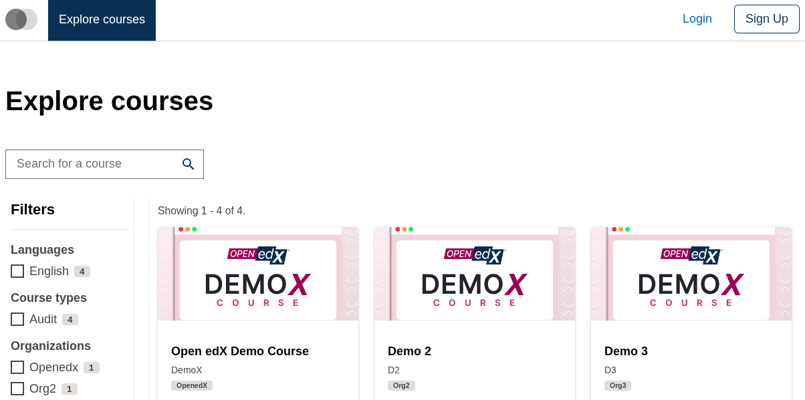
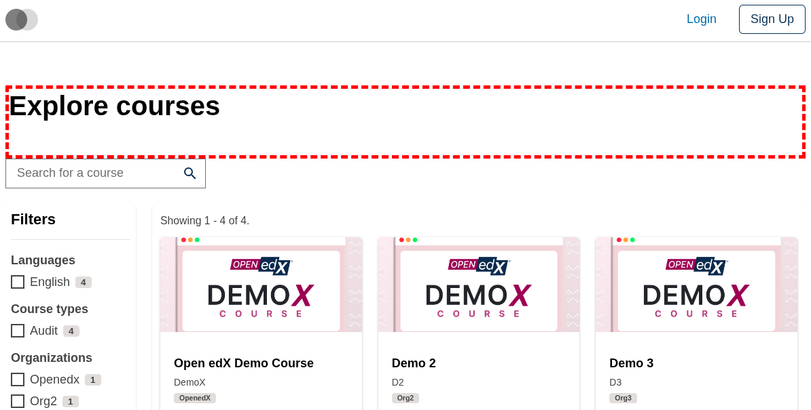
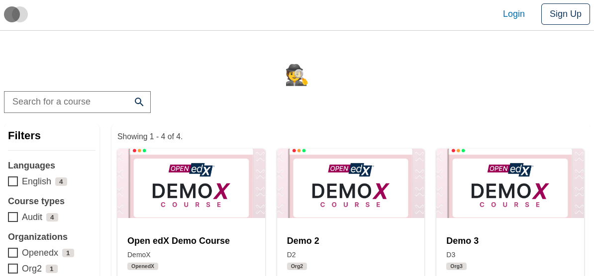
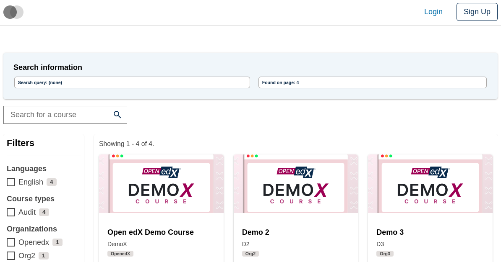

# Course Catalog Intro Slot

### Slot ID: `org.openedx.frontend.slot.catalog.courseCatalogIntro.v1`

### Slot Props

* `searchString: string` — the current search query string entered in the course catalog search field.
* `courseDataResultsLength?: number` — the number of results on the current search page (undefined until the search response arrives).

## Description

This slot is used to replace/modify/hide the entire Course catalog page intro section.

## Examples

### Default content



### Wrapped with a red border (custom layout)



To keep the default content but wrap it in extra markup, replace the slot's **layout**.

```diff
-import { EnvironmentTypes, SiteConfig, ... } from '@openedx/frontend-base';
+import { EnvironmentTypes, LayoutOperationTypes, SiteConfig, useWidgets, ... } from '@openedx/frontend-base';

 import { catalogApp } from './src';

 import '@openedx/frontend-base/shell/style';

+const BorderedLayout = () => {
+  const widgets = useWidgets();
+  return <div style={{ border: 'thick dashed red' }}>{widgets}</div>;
+};
+
 const siteConfig: SiteConfig = {
   // ...
   apps: [
     // ...
     {
       ...catalogApp,
+      slots: [
+        {
+          slotId: 'org.openedx.frontend.slot.catalog.courseCatalogIntro.v1',
+          op: LayoutOperationTypes.REPLACE,
+          component: BorderedLayout,
+        },
+      ],
     },
   ],
 };
```

### Replaced with a simple custom component



Add the following to your site config to replace the Course catalog intro entirely (in this case with a centered "🕵️" `h1` tag).

```diff
-import { EnvironmentTypes, SiteConfig, ... } from '@openedx/frontend-base';
+import { EnvironmentTypes, WidgetOperationTypes, SiteConfig, ... } from '@openedx/frontend-base';

 const siteConfig: SiteConfig = {
   // ...
   apps: [
     // ...
     {
       ...catalogApp,
+      slots: [
+        {
+          slotId: 'org.openedx.frontend.slot.catalog.courseCatalogIntro.v1',
+          id: 'customCourseCatalogIntro',
+          op: WidgetOperationTypes.REPLACE,
+          relatedId: 'defaultContent',
+          element: <h1 style={{ textAlign: 'center' }}>🕵️</h1>,
+        },
+      ],
     },
   ],
 };
```

### Replaced with a custom component using the slot's props



Add the following to your site config to replace the Course catalog intro with an alert component that reads the slot's `searchString` and `courseDataResultsLength` props.

```diff
-import { EnvironmentTypes, SiteConfig, ... } from '@openedx/frontend-base';
+import { EnvironmentTypes, WidgetOperationTypes, SiteConfig, ... } from '@openedx/frontend-base';

-import { catalogApp } from './src';
+import { catalogApp, type CourseCatalogIntroSlotProps } from './src';

+import { Alert, Stack, Chip } from '@openedx/paragon';
+
 import '@openedx/frontend-base/shell/style';

+const customCatalogIntro = ({ searchString, courseDataResultsLength }: CourseCatalogIntroSlotProps) => (
+  <Alert variant="info">
+    <Alert.Heading>Search information</Alert.Heading>
+    <Stack direction="horizontal" gap={3}>
+      <Chip>Search query: {searchString || '(none)'}</Chip>
+      <Chip>Found on page: {courseDataResultsLength ?? 0}</Chip>
+    </Stack>
+  </Alert>
+);
+
 const siteConfig: SiteConfig = {
   // ...
   apps: [
     // ...
     {
       ...catalogApp,
+      slots: [
+        {
+          slotId: 'org.openedx.frontend.slot.catalog.courseCatalogIntro.v1',
+          id: 'customCourseCatalogIntro',
+          op: WidgetOperationTypes.REPLACE,
+          relatedId: 'defaultContent',
+          component: customCatalogIntro,
+        },
+      ],
     },
   ],
 };
```
