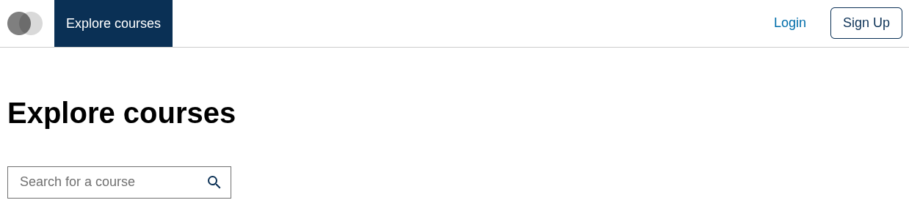
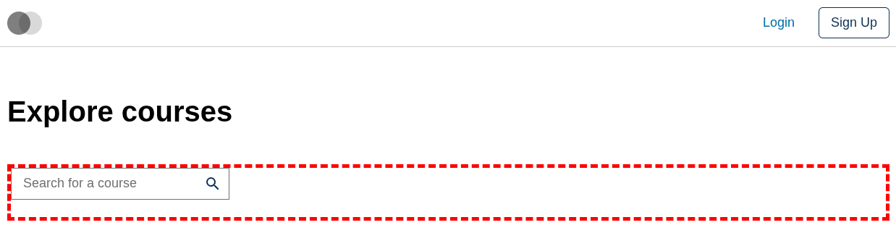
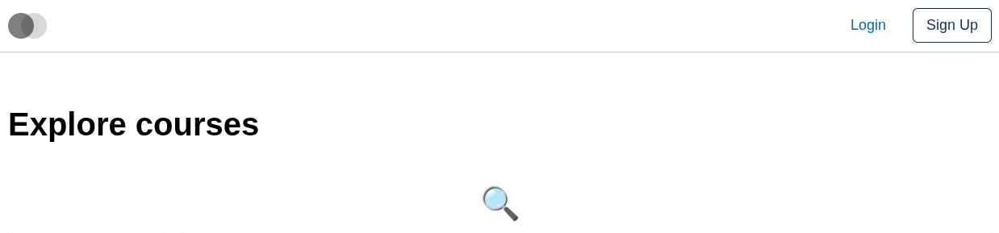
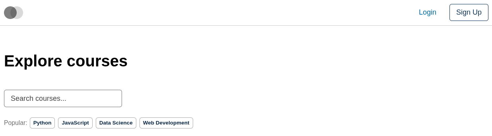

# Course Catalog Search Field Slot

### Slot ID: `org.openedx.frontend.slot.catalog.courseCatalogSearchField.v1`

### Slot Props

* `setSearchInput: (value: string) => void` — invoke to update the catalog's search input state.
* `handleSearch: (value: string) => void` — invoke to submit a search query and trigger the search operation.
* `initialSearchValue?: string` — the initial search query value from the URL parameter (`search_query`).

## Description

This slot is used to replace/modify/hide the entire Course catalog page search field.

## Examples

### Default content



### Wrapped with a red border (custom layout)



To keep the default content but wrap it in extra markup, replace the slot's **layout**.

```diff
-import { EnvironmentTypes, SiteConfig, ... } from '@openedx/frontend-base';
+import { EnvironmentTypes, LayoutOperationTypes, SiteConfig, useWidgets, ... } from '@openedx/frontend-base';

 import { catalogApp } from './src';

 import '@openedx/frontend-base/shell/style';

+const BorderedLayout = () => {
+  const widgets = useWidgets();
+  return <div style={{ border: 'thick dashed red' }}>{widgets}</div>;
+};
+
 const siteConfig: SiteConfig = {
   // ...
   apps: [
     // ...
     {
       ...catalogApp,
+      slots: [
+        {
+          slotId: 'org.openedx.frontend.slot.catalog.courseCatalogSearchField.v1',
+          op: LayoutOperationTypes.REPLACE,
+          component: BorderedLayout,
+        },
+      ],
     },
   ],
 };
```

### Replaced with a simple custom component



Add the following to your site config to replace the Course catalog search field entirely (in this case with a centered "🔍" `h1` tag).

```diff
-import { EnvironmentTypes, SiteConfig, ... } from '@openedx/frontend-base';
+import { EnvironmentTypes, WidgetOperationTypes, SiteConfig, ... } from '@openedx/frontend-base';

 const siteConfig: SiteConfig = {
   // ...
   apps: [
     // ...
     {
       ...catalogApp,
+      slots: [
+        {
+          slotId: 'org.openedx.frontend.slot.catalog.courseCatalogSearchField.v1',
+          id: 'customCourseCatalogSearchField',
+          op: WidgetOperationTypes.REPLACE,
+          relatedId: 'defaultContent',
+          element: <h1 style={{ textAlign: 'center' }}>🔍</h1>,
+        },
+      ],
     },
   ],
 };
```

### Replaced with a custom component using the slot's props



Add the following to your site config to replace the Course catalog search field with a floating-label input plus a row of "popular searches" chips that invoke `setSearchInput` / `handleSearch` when clicked.

```diff
-import { EnvironmentTypes, SiteConfig, ... } from '@openedx/frontend-base';
+import { EnvironmentTypes, WidgetOperationTypes, SiteConfig, ... } from '@openedx/frontend-base';

-import { catalogApp } from './src';
+import { catalogApp, type CourseCatalogSearchFieldSlotProps } from './src';

+import { useState } from 'react';
+import { Stack, Chip, Form } from '@openedx/paragon';
+
 import '@openedx/frontend-base/shell/style';

+const customSearchField = ({ setSearchInput, handleSearch }: CourseCatalogSearchFieldSlotProps) => {
+  const [searchValue, setSearchValue] = useState('');
+  const popularSearches = ['Python', 'JavaScript', 'Data Science', 'Web Development'];
+
+  const handleQuickSearch = (query: string) => {
+    setSearchValue(query);
+    setSearchInput(query);
+    handleSearch(query);
+  };
+
+  return (
+    <Stack gap={2} className="mb-4 w-25">
+      <Form.Group>
+        <Form.Control
+          floatingLabel="Search courses..."
+          value={searchValue}
+          onChange={(e) => {
+            const value = e.target.value;
+            setSearchValue(value);
+            setSearchInput(value);
+          }}
+        />
+      </Form.Group>
+      <Stack direction="horizontal" gap={1}>
+        <span className="text-muted small">Popular:</span>
+        {popularSearches.map((query) => (
+          <Chip key={query} onClick={() => handleQuickSearch(query)}>
+            {query}
+          </Chip>
+        ))}
+      </Stack>
+    </Stack>
+  );
+};
+
 const siteConfig: SiteConfig = {
   // ...
   apps: [
     // ...
     {
       ...catalogApp,
+      slots: [
+        {
+          slotId: 'org.openedx.frontend.slot.catalog.courseCatalogSearchField.v1',
+          id: 'customCourseCatalogSearchField',
+          op: WidgetOperationTypes.REPLACE,
+          relatedId: 'defaultContent',
+          component: customSearchField,
+        },
+      ],
     },
   ],
 };
```
