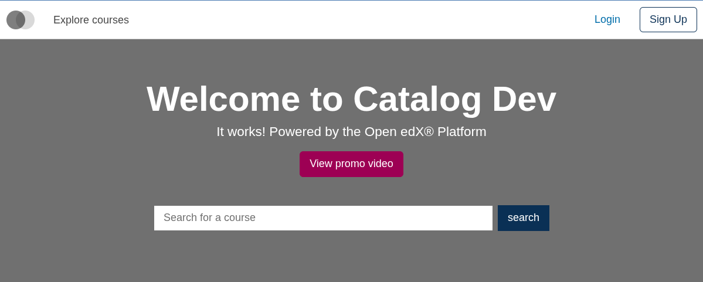
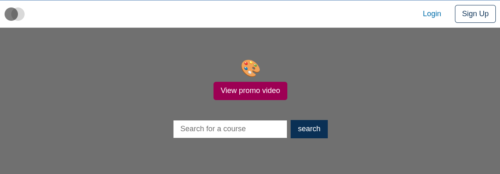

# Home Overlay HTML Slot

### Slot ID: `org.openedx.frontend.slot.catalog.homeOverlayHtml.v1`

## Description

This slot is used to replace/modify/hide the entire Home page overlay HTML.

## Examples

### Default content



### Replaced with a custom component



Add the following to your site config to replace the Home page overlay HTML entirely (in this case with a centered "🎨" `h1` tag). The diff below is against this app's `site.config.dev.tsx`.

```diff
-import { EnvironmentTypes, SiteConfig, ... } from '@openedx/frontend-base';
+import { EnvironmentTypes, WidgetOperationTypes, SiteConfig, ... } from '@openedx/frontend-base';

 const siteConfig: SiteConfig = {
   // ...
   apps: [
     // ...
     {
       ...catalogApp,
+      slots: [
+        {
+          slotId: 'org.openedx.frontend.slot.catalog.homeOverlayHtml.v1',
+          id: 'customHomeOverlayHtml',
+          op: WidgetOperationTypes.REPLACE,
+          relatedId: 'defaultContent',
+          element: <h1 style={{ textAlign: 'center' }}>🎨</h1>,
+        },
+      ],
     },
   ],
 };
```
