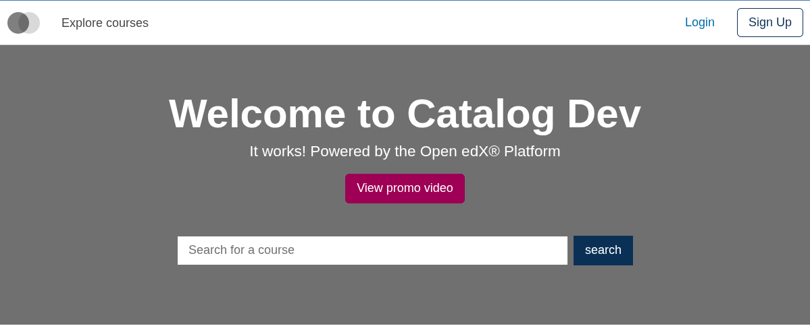
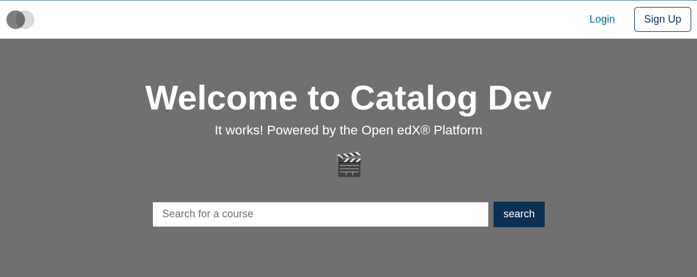
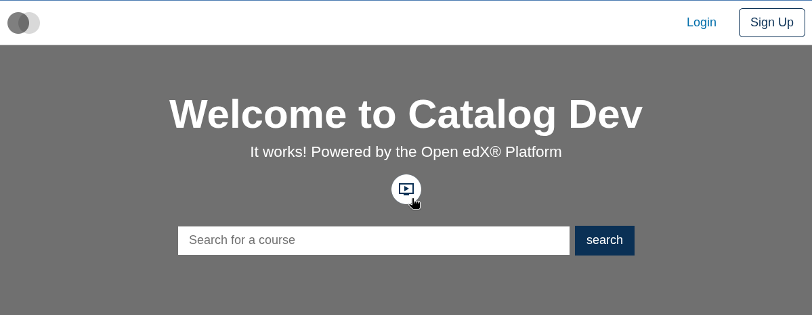

# Home Promo Video Button Slot

### Slot ID: `org.openedx.frontend.slot.catalog.homePromoVideoButton.v1`

### Slot Props

* `onClick: () => void` — the handler that opens the promo-video modal.

## Description

This slot is used to replace/modify/hide the entire Home page promo video button.

## Examples

### Default content



### Replaced with a simple custom component



Add the following to your site config to replace the Home page promo video button entirely (in this case with a centered "🎬" `h1` tag). The diff below is against this app's `site.config.dev.tsx`.

```diff
-import { EnvironmentTypes, SiteConfig, ... } from '@openedx/frontend-base';
+import { EnvironmentTypes, WidgetOperationTypes, SiteConfig, ... } from '@openedx/frontend-base';

 const siteConfig: SiteConfig = {
   // ...
   apps: [
     // ...
     {
       ...catalogApp,
+      slots: [
+        {
+          slotId: 'org.openedx.frontend.slot.catalog.homePromoVideoButton.v1',
+          id: 'customHomePromoVideoButton',
+          op: WidgetOperationTypes.REPLACE,
+          relatedId: 'defaultContent',
+          element: <h1 style={{ textAlign: 'center' }}>🎬</h1>,
+        },
+      ],
     },
   ],
 };
```

### Replaced with a custom component using the slot's `onClick` prop



Add the following to your site config to replace the Home page promo video button with a circle-wrapped `IconButton` that calls the slot's `onClick` prop. The diff below is against this app's `site.config.dev.tsx`.

```diff
-import { EnvironmentTypes, SiteConfig, ... } from '@openedx/frontend-base';
+import { EnvironmentTypes, WidgetOperationTypes, SiteConfig, ... } from '@openedx/frontend-base';

-import { catalogApp } from './src';
+import { catalogApp, type HomePromoVideoButtonSlotProps } from './src';

+import { OndemandVideo } from '@openedx/paragon/icons';
+import { IconButton } from '@openedx/paragon';
+
 import '@openedx/frontend-base/shell/style';

+const customVideoButton = ({ onClick }: HomePromoVideoButtonSlotProps) => (
+  <div className="bg-primary rounded-circle">
+    <IconButton src={OndemandVideo} alt="Video" invertColors onClick={onClick} />
+  </div>
+);
+
 const siteConfig: SiteConfig = {
   // ...
   apps: [
     // ...
     {
       ...catalogApp,
+      slots: [
+        {
+          slotId: 'org.openedx.frontend.slot.catalog.homePromoVideoButton.v1',
+          id: 'customHomePromoVideoButton',
+          op: WidgetOperationTypes.REPLACE,
+          relatedId: 'defaultContent',
+          component: customVideoButton,
+        },
+      ],
     },
   ],
 };
```
