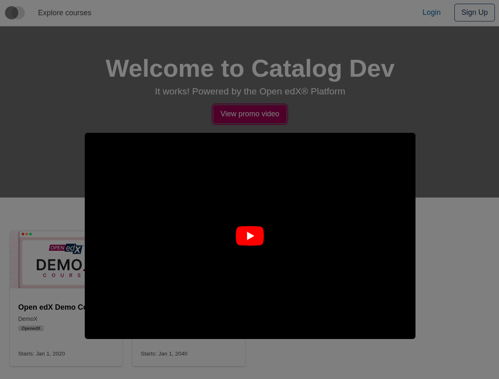
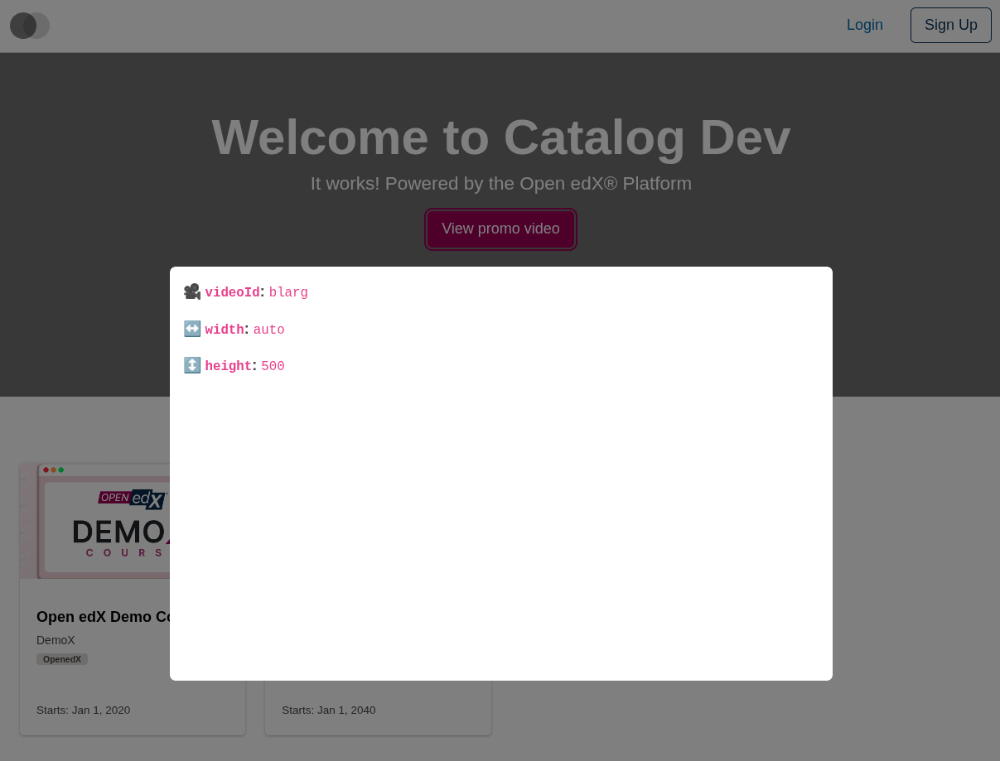

# Home Promo Video Modal Content Slot

### Slot ID: `org.openedx.frontend.slot.catalog.homePromoVideoModalContent.v1`

### Slot Props

* `videoId: string` — the YouTube video ID for the embed.
* `width?: string` — optional iframe width override.
* `height?: number` — optional iframe height override.

## Description

This slot is used to replace/modify/hide the entire Home page promo video modal content.

## Examples

### Default content



### Replaced with a custom component using the slot's props



Add the following to your site config to replace the Home page promo video modal content with a custom component that displays the slot's `videoId`, `width`, and `height` props. The diff below is against this app's `site.config.dev.tsx`.

```diff
-import { EnvironmentTypes, SiteConfig, ... } from '@openedx/frontend-base';
+import { EnvironmentTypes, WidgetOperationTypes, SiteConfig, ... } from '@openedx/frontend-base';

-import { catalogApp } from './src';
+import { catalogApp, type HomePromoVideoModalContentSlotProps } from './src';

 import '@openedx/frontend-base/shell/style';

+const customVideoModalContent = ({ videoId, width, height }: HomePromoVideoModalContentSlotProps) => (
+  <div className="bg-white p-3" style={{ width, height }}>
+    <p>🎥 <strong><code>videoId</code>:</strong> <code>{videoId}</code></p>
+    <p>↔️ <strong><code>width</code>:</strong> <code>{width}</code></p>
+    <p>↕️ <strong><code>height</code>:</strong> <code>{height}</code></p>
+  </div>
+);
+
 const siteConfig: SiteConfig = {
   // ...
   apps: [
     // ...
     {
       ...catalogApp,
+      slots: [
+        {
+          slotId: 'org.openedx.frontend.slot.catalog.homePromoVideoModalContent.v1',
+          id: 'customHomePromoVideoModalContent',
+          op: WidgetOperationTypes.REPLACE,
+          relatedId: 'defaultContent',
+          component: customVideoModalContent,
+        },
+      ],
     },
   ],
 };
```
