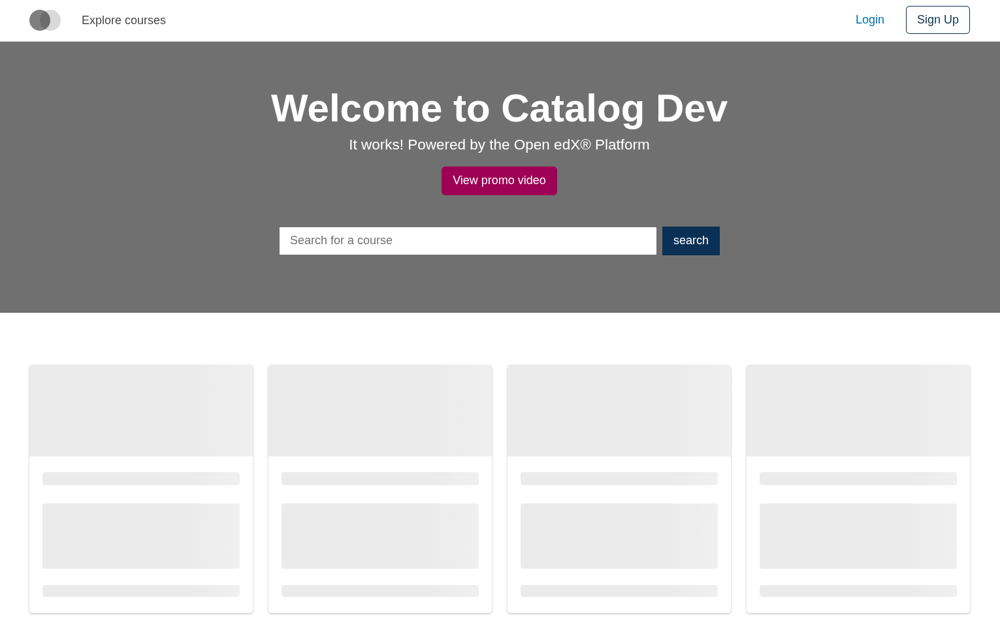
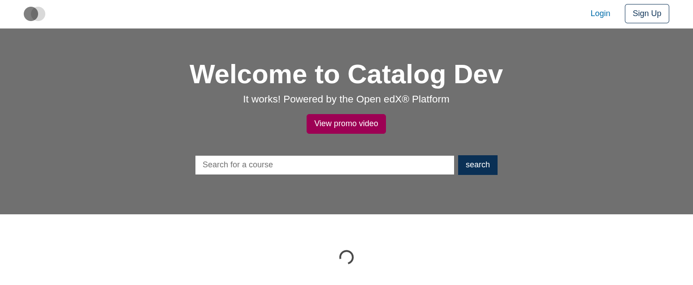

# Loader Slot

### Slot ID: `org.openedx.frontend.slot.catalog.loader.v1`

## Description

This slot wraps whatever loading content its caller provides (skeleton cards, spinners, etc.) so operators can replace the default loader with a custom one.

## Examples

### Default content



### Replaced with a custom spinner



Add the following to your site config to replace the default loader (in this case with a centered paragon `Spinner`). The diff below is against this app's `site.config.dev.tsx`.

```diff
-import { EnvironmentTypes, SiteConfig, ... } from '@openedx/frontend-base';
+import { EnvironmentTypes, WidgetOperationTypes, SiteConfig, ... } from '@openedx/frontend-base';

 import { catalogApp } from './src';

+import { Container, Spinner } from '@openedx/paragon';
+
 import '@openedx/frontend-base/shell/style';

+const customLoader = () => (
+  <Container className="text-center">
+    <Spinner animation="border" screenReaderText="Loading..." />
+  </Container>
+);
+
 const siteConfig: SiteConfig = {
   // ...
   apps: [
     // ...
     {
       ...catalogApp,
+      slots: [
+        {
+          slotId: 'org.openedx.frontend.slot.catalog.loader.v1',
+          id: 'customLoader',
+          op: WidgetOperationTypes.REPLACE,
+          relatedId: 'defaultContent',
+          component: customLoader,
+        },
+      ],
     },
   ],
 };
```
